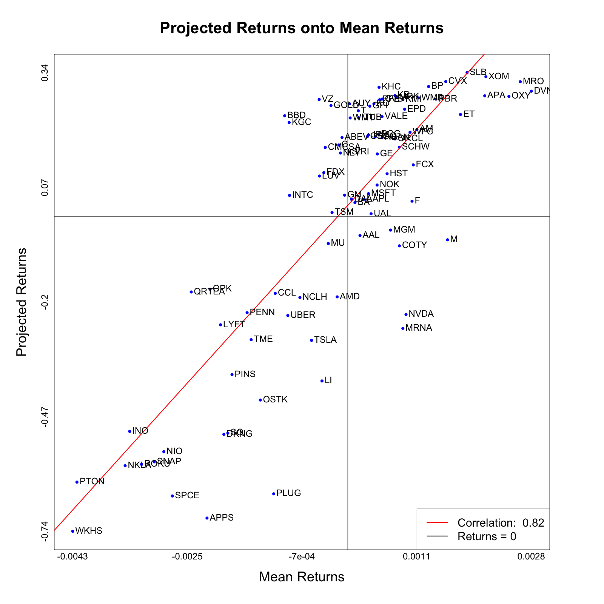

# Instructions

The file `90returns.csv` contains returns of $90$ most active stocks over $523$ days (the full names are in file `mostactive.csv`). The presentation matters (imagine yourself as a data analyst presenting the data-driven decision on the optimal investment in front of venture capitalists/shark tank TV show).

1. ($10$ points). Project returns onto the line. Use `rug` and `density` to display the projections and their pdf. Use text with the options `srt=90` and `adj=0` to display the symbols. Report the variance explained by projection onto the line in the title.

2. ($15$ points). Validate the PCA ranking of the returns from the lowest to the highest using the mean of the returns over the entire period. Display the regression line and the symbols using the text command with the option `adj=0`. Use the `legend("bottomright"...)` with the value of the correlation coefficient rounded up to the second decimal. Show the vertical and horizontal lines with zero return. Print out the stock symbols, the full names of the companies, the value of the positive projection returns, and the mean of the returns (create a data frame and print it out).

3. (10 points). Project returns onto the plane. Use rug on both axes to show the projections. Display the symbols as in part $2$. Display the $\%$ variance explained by the PCA projection onto the 1st and 2nd component at x-axis and y-axis, respectively, and onto plane at the title. Plot the PCA points using red color with `pch=16, cex=1.5` for which the mean of the returns is positive. Explain the result.

4. (10 points). Apply hierarchical clustering to the return data analyzed above. Does the dendrogram match the companies’ standing from Problem $1$? Give a qualitative answer.

5. (15 points). Find the optimal `K` using the broken-line algorithm. Compute the p-value for testing the hypothesis that there are no clusters (print out the observed `r` and the range of the simulated `rs`, use `nSim=1000`).

6. (10 points). Display the K-means clusters on the PCA projection onto plane as in Problem $3$ (use different colors for different clusters), and commment of the difference with the positive returns.

# Solutions

## Interpretations

1. The variance explained by the projection onto the line is $21.23\%$. We can see a slight bimodal density with a shorter peak on the left tail, and the main peak around a projected return of $0.25$.

2. We can see that the returns projected onto the first principal component has a high positive correlation of $0.82$ with mean returns. This is good, as it means our one-dimensional PCA ranking is in the correct order. There were $58$ companies with positive projected returns, and $51$ companies positive mean returns.

Here is the printed summary of the data frame with projected returns, mean returns, and company names ordered in ascending order by mean returns:

```bash
      projected_return   mean_return                                          full_name
WKHS      -0.738690618 -4.250015e-03                               Workhorse Group Inc.
PTON      -0.623322042 -4.184500e-03                          Peloton Interactive, Inc.
NKLA      -0.585040106 -3.440249e-03                                 Nikola Corporation
INO       -0.504443399 -3.369771e-03                       Inovio Pharmaceuticals, Inc.
ROKU      -0.581738212 -3.186538e-03                                         Roku, Inc.
SNAP      -0.575952429 -2.992107e-03                                          Snap Inc.
NIO       -0.552153289 -2.841853e-03                                        NIO Limited
SPCE      -0.655849216 -2.711762e-03                     Virgin Galactic Holdings, Inc.
QRTEA     -0.177559555 -2.419535e-03                                Qurate Retail, Inc.
APPS      -0.707678201 -2.175501e-03                              Digital Turbine, Inc.
OPK       -0.170982887 -2.128109e-03                                  OPKO Health, Inc.
LYFT      -0.254511973 -1.967063e-03                                         Lyft, Inc.
DKNG      -0.511394329 -1.914721e-03                                    DraftKings Inc.
SQ        -0.508414543 -1.853271e-03                                       Square, Inc.
PINS      -0.371443426 -1.789432e-03                                    Pinterest, Inc.
PENN      -0.226170873 -1.555921e-03                         Penn National Gaming, Inc.
TME       -0.289547450 -1.493405e-03                  Tencent Music Entertainment Group
OSTK      -0.430916244 -1.352583e-03                                Overstock.com, Inc.
PLUG      -0.650873215 -1.144551e-03                                    Plug Power Inc.
CCL       -0.180823498 -1.120875e-03                         Carnival Corporation & Plc
BBD        0.235603512 -9.751745e-04                                Banco Bradesco S.A.
UBER      -0.232655453 -9.271452e-04                            Uber Technologies, Inc.
KGC        0.219762950 -9.066487e-04                           Kinross Gold Corporation
INTC       0.048944243 -9.009029e-04                                  Intel Corporation
NCLH      -0.190391046 -7.405350e-04                Norwegian Cruise Line Holdings Ltd.
TSLA      -0.290970569 -5.609129e-04                                        Tesla, Inc.
VZ         0.273815540 -4.426589e-04                        Verizon Communications Inc.
LUV        0.094266381 -4.382767e-04                             Southwest Airlines Co.
LI        -0.386248706 -3.994643e-04                                       Li Auto Inc.
FDX        0.102338103 -3.704355e-04                                  FedEx Corporation
CMCSA      0.161350171 -3.485824e-04                                Comcast Corporation
MU        -0.063945430 -3.017408e-04                            Micron Technology, Inc.
GOLD       0.259423648 -2.603841e-04                           Barrick Gold Corporation
TSM        0.008594936 -2.438002e-04 Taiwan Semiconductor Manufacturing Company Limited
AMD       -0.189073316 -1.656543e-04                       Advanced Micro Devices, Inc.
C          0.167095502 -1.396927e-04                                     Citigroup Inc.
NLY        0.148188991 -1.152433e-04                    Annaly Capital Management, Inc.
ABEV       0.184711439 -8.977929e-05                                         Ambev S.A.
GM         0.049518495 -4.937377e-05                             General Motors Company
SIRI       0.150836019  1.951419e-05                            Sirius XM Holdings Inc.
AUY        0.263708957  2.588640e-05                                   Yamana Gold Inc.
WMT        0.230494065  3.556339e-05                                       Walmart Inc.
DAL        0.039759366  5.642671e-05                              Delta Air Lines, Inc.
BA         0.031757153  1.102272e-04                                 The Boeing Company
T          0.247374001  1.618026e-04                                          AT&T Inc.
ITUB       0.231023237  1.671737e-04                         Itaú Unibanco Holding S.A.
AAL       -0.045206367  1.876295e-04                       American Airlines Group Inc.
AAPL       0.039648004  2.459696e-04                                         Apple Inc.
CSCO       0.187273079  3.048073e-04                                Cisco Systems, Inc.
JPM        0.190815357  3.187317e-04                               JPMorgan Chase & Co.
MSFT       0.052923876  3.193170e-04                              Microsoft Corporation
GFI        0.258193896  3.395297e-04                                Gold Fields Limited
UAL        0.005803790  3.586851e-04                     United Airlines Holdings, Inc.
KO         0.263533817  4.028898e-04                              The Coca-Cola Company
BAC        0.186429932  4.229118e-04                        Bank of America Corporation
NOK        0.073176001  4.515941e-04                                  Nokia Corporation
GE         0.146128150  4.545829e-04                           General Electric Company
PCG        0.192125518  4.733776e-04                                   PG&E Corporation
KHC        0.302522917  4.820061e-04                            The Kraft Heinz Company
PFE        0.273227091  4.918122e-04                                        Pfizer Inc.
VALE       0.233565414  5.281375e-04                                          Vale S.A.
HBAN       0.184289987  5.291563e-04                 Huntington Bancshares Incorporated
CVS        0.274823149  5.304232e-04                             CVS Health Corporation
HST        0.099551359  6.062519e-04                        Host Hotels & Resorts, Inc.
MGM       -0.032468338  6.596588e-04                          MGM Resorts International
KR         0.283038783  7.275689e-04                                     The Kroger Co.
ORCL       0.181317156  7.296978e-04                                 Oracle Corporation
MRK        0.279929893  7.512062e-04                                  Merck & Co., Inc.
SCHW       0.161927869  7.949350e-04                     The Charles Schwab Corporation
COTY      -0.069403022  7.958982e-04                                          Coty Inc.
MRNA      -0.262845551  8.502728e-04                                      Moderna, Inc.
KMI        0.273701435  8.503183e-04                                Kinder Morgan, Inc.
EPD        0.250913893  8.774554e-04                  Enterprise Products Partners L.P.
NVDA      -0.230170690  8.986040e-04                                 NVIDIA Corporation
WFC        0.197087677  9.612680e-04                              Wells Fargo & Company
F          0.035429816  9.916483e-04                                 Ford Motor Company
FCX        0.120431768  1.010560e-03                              Freeport-McMoRan Inc.
AM         0.203462650  1.066682e-03                       Antero Midstream Corporation
WMB        0.277382700  1.097475e-03                       The Williams Companies, Inc.
BP         0.304146859  1.247543e-03                                          BP p.l.c.
PBR        0.274646755  1.360970e-03               Petróleo Brasileiro S.A. - Petrobras
CVX        0.315819023  1.512443e-03                                Chevron Corporation
M         -0.055230635  1.540342e-03                                       Macy's, Inc.
ET         0.238524396  1.739985e-03                                 Energy Transfer LP
SLB        0.336582381  1.841893e-03                               Schlumberger Limited
APA        0.282331821  2.115280e-03                                 Apache Corporation
XOM        0.327049847  2.132989e-03                            Exxon Mobil Corporation
OXY        0.281112787  2.488396e-03                   Occidental Petroleum Corporation
MRO        0.315523331  2.663866e-03                           Marathon Oil Corporation
DVN        0.293155741  2.833944e-03                           Devon Energy Corporation
```

3. The PCA projection onto a plane explains about $28\%$ of the total variance. It is clear that the projected points towards the right tend to have positive mean returns, and the projected points towards the left tend to have negative mean returns. However, it is hard to see any clear pattern in the projected points along the vertical direction. This is due to the fact that the the second principal component only explains about $7\%$ of the total variance, and thus the ranking of companies along the vertical direction is not very meaningful.

4. I applied hierarchical clustering with several different distance types. `ward.D` and `ward.D2` both show two main clusters. The other distance types such as `single`, `complete`, `average` do not show clear large clusters. Below, I plot the `ward.D2` dendrogram, as it shows the two clusters most clearly. Looking closely, the companies in the left cluster align with the companies associated with the first smaller bimodal peak in the density plot from question $1$, and the companies in the right cluster align with the companies associated with the second taller bimodal peak in the density plot from question $1$. The companies in the left cluster tend to have negative mean returns, and the companies in the right cluster tend to have positive mean returns. The fact that the clusters generated align with mean returns and PCA projected returns is meaningful evidence that our clustering is robust.

5. The optimal K broken-line algorithm returns an optimal number of clusters of $2$, even when I used `Kmax = 10`, so this optimal number of clusters is fairly robust. My data driven $r$ test statistic, which I called `r_star` in the code was $1.206$, and my simulated $r$ test statistics ranged from $1.018$ to $1.021$. Because the proportion of simulated $r$ values that were greater than my data driven $r$ value is $0$, my empirical p-value is $0$ and thus I rejected the null hypothesis that the data is a single cluster. This is consistent with the results from hierarchical clustering in question $4$, and the bimodal pattern observed in the density plot from question $1$, further supporting the robustness of our clustering.

Here are the printed results:

```bash
[1] "Optimal number of clusters = 2"
[1] "r* = 1.20603083166645"
[1] "Simulated r value ranges from 1.01835357835415 to 1.02112584158524"
[1] "p value = 0"
```

6. It is clear that the two clusters align with companies that either have either positive or negative mean returns, with a few exceptions, and that the multi dimensional k-means clustering held when the clusters were projected onto a plane. The two clusters are also consistent with the two clusters from hierarchical clustering in question $4$, and the bimodal pattern observed in the density plot from question $1$. This is further evidence that our clustering is robust.

## Code

```r
### Load Data

# Define returns dataframe
returns <- read.csv("./exams/final/data/90returns.csv", header = TRUE)

# Define full names dataframe
full_names <- read.csv("./exams/final/data/mostactive.csv", header = FALSE)

# label first column as "symbol", second column as "full_name"
colnames(full_names) <- c("symbol", "full_name")

### Question 1

# Transpose the data to compare companies
returns <- t(returns)

# Define a covariance matrix of the features
W <- cov(returns)

# Get the eigenvalues and eigenvectors of the covariance matrix
eigen <- eigen(W, symmetric = TRUE)

# Get the eigenvector with the largest eigenvalue
p <- eigen$vectors[, 1]

# Center the data
Z <- scale(returns, center = TRUE, scale = FALSE)

# Project the data onto the line spanned by the eigenvector
proj <- Z %*% p

# Get the maximum eigenvalue
lambda <- eigen$values[1]

# Compute total variance as the sum of the eigenvalues
total_variance <- sum(eigen$values)

# Compute the variance explained by the first PCA component
variance_explained <- lambda / total_variance

## Plotting

# Open a png device
png("./exams/final/plots/q1.png", width = 2400, height = 1200)

# Set the margins
par(mar = c(10, 10, 10, 10))

main_text <- paste("Density of Company Returns Projected onto First Principal Component",
    "\nVariance Explained by First Principal Component: ",
    round(variance_explained * 100, 2), "%",
    sep = ""
)

# Plot the density of the projected data
plot(
    density(proj[, 1]),
    type = "l", col = "blue",
    lwd = 3, xlab = "", ylab = "",
    main = main_text, cex.main = 3.5,
    yaxt = "n", xaxt = "n"
)

# Add a rug plot
rug(proj[, 1], col = "blue", lwd = 2, ticksize = 0.05)

# Add x axis label for projected returns
returns_labels <- seq(-1, .5, length.out = 7)
axis(1,
    at = returns_labels,
    labels = round(returns_labels, 2), cex.axis = 2,
    lwd = 0
)
mtext("Projected Returns", side = 1, line = 5, cex = 3)

# Get the row labels of proj
row_labels <- rownames(proj)

# Add label for company symbols
text(
    proj[, 1], .15,
    labels = row_labels, cex = 2,
    pos = 1, adj = 0, srt = 90
)

# Add y axis label for density
max_density <- max(density(proj[, 1])$y)
density_labels <- seq(0, max_density, length.out = 5)
axis(2,
    at = density_labels, labels = round(density_labels, 2),
    las = 2, cex.axis = 2, lwd = 0
)
axis(2,
    at = max_density / 2, labels = c("Density"), cex.axis = 3, padj = -3
)

# Add a legend
legend(
    "topright",
    legend = c("Density"),
    col = c("blue"), lwd = 3,
    cex = 2.5
)

# Close the png device
dev.off()

### Question 2

# Get mean of each company's returns
mean_returns <- colMeans(t(returns))

# Make a dataframe of the projected returns and mean returns
comparison <- data.frame(proj, mean_returns)

# Define the column names
colnames(comparison) <- c("projected_return", "mean_return")

# Rank comparison by mean returns
comparison <- comparison[order(comparison[, 2]), ]

# Get the row names of comparison
comparison_rows <- rownames(comparison)

# Add a full_name column to comparison
comparison$full_name <- full_names[match(comparison_rows, full_names$symbol), 2]

# Print comparison dataframe
print(comparison, width = 100)

# Print the number of companies with positive projected returns
print(paste(
    "Number of Companies with Positive Projected Returns:",
    sum(comparison[, 1] > 0)
))

# Print the number of companies with positive mean returns
print(paste(
    "Number of Companies with Positive Mean Returns:",
    sum(comparison[, 2] > 0)
))

# Regress projected returns onto mean returns
regression <- lm(comparison[, 1] ~ comparison[, 2])

# Get the correlation coefficient
correlation <- cor(comparison[, 1], comparison[, 2])

## Plotting

# Open a png device
png("./exams/final/plots/q2.png", width = 1600, height = 1600)

# Set the margins
par(mar = c(10, 10, 10, 10))

# Plot the projected returns against the mean returns
plot(
    comparison[, 2], comparison[, 1],
    col = "blue", pch = 16, cex = 1.5,
    xlab = "", ylab = "",
    main = "Projected Returns onto Mean Returns", cex.main = 3.5,
    xaxt = "n", yaxt = "n"
)

# Add a regression line
abline(regression, col = "red", lwd = 3)

# Add x axis labeling
x_labels <- seq(min(mean_returns), max(mean_returns), length.out = 5)
center <- mean(x_labels)
axis(1,
    at = x_labels,
    labels = round(x_labels, 4), cex.axis = 2,
    lwd = 0
)
mtext("Mean Returns", side = 1, line = 5, cex = 3)

# Add y axis labeling
y_labels <- seq(min(proj[, 1]), max(proj[, 1]), length.out = 5)
center <- mean(y_labels)
axis(2,
    at = y_labels,
    labels = round(y_labels, 2), cex.axis = 2,
    lwd = 0
)
mtext("Projected Returns", side = 2, line = 5, cex = 3)


# Label each point with the company symbol
text(
    comparison[, 2], comparison[, 1],
    labels = rownames(comparison), cex = 2,
    pos = 4, adj = 0
)

# Add lines for y and x = 0
abline(h = 0, col = "black", lwd = 2)
abline(v = 0, col = "black", lwd = 2)

# Add a legend
legend(
    "bottomright",
    legend = c(paste("Correlation: ", round(correlation, 2)), "Returns = 0"),
    col = c("red", "black"), lwd = 3,
    cex = 2.5
)

# Close the png device
dev.off()

### Question 3

# Get the first two principal components
p <- eigen$vectors[, 1:2]

# Project the data onto the first two principal components
proj <- Z %*% p

# Add a third column to proj for mean returns
proj <- cbind(proj, mean_returns)

# Get the two eigenvalues
lambda <- eigen$values[1:2]

# Compute the variance explained by the first two PCA components
variance_explained_1 <- lambda[1] / total_variance
variance_explained_2 <- lambda[2] / total_variance

# Compute the total variance explained by the first two PCA components
total_variance_explained <- variance_explained_1 + variance_explained_2

## Plotting

# Open a png device
png("./exams/final/plots/q3.png", width = 1600, height = 1600)

# Set the margins
par(mar = c(10, 10, 10, 10))

# Set the x and y labels
xlabel <- paste(
    "1st PCA Component Explains ",
    round(variance_explained_1 * 100, 2), "% of the Variance",
    sep = ""
)
ylabel <- paste(
    "2nd PCA Component Explains ",
    round(variance_explained_2 * 100, 2), "% of the Variance",
    sep = ""
)

# Set the main text
main_text <- paste(
    "PCA Projection of Company Returns Onto Plane
    Total Variance Explained: ",
    round(total_variance_explained * 100, 2), "%",
    sep = ""
)

# Plot the projection (mean_returns > 0 -> red, mean_returns < 0 -> blue)
plot(
    proj[, 1], proj[, 2],
    col = ifelse(proj[, 3] > 0, "red", "blue"), pch = 16, cex = 1.5,
    xlab = "", ylab = "",
    main = main_text, cex.main = 3.5,
    xaxt = "n", yaxt = "n"
)

# Add a rug for both axes
rug(proj[, 1], side = 1, col = "black", lwd = 2)
rug(proj[, 2], side = 2, col = "black", lwd = 2)

# Add x and y axis labels
mtext(xlabel, side = 1, line = 5, cex = 3)
mtext(ylabel, side = 2, line = 5, cex = 3)

# Add tick marks for x and y axes
x_labels <- seq(min(proj[, 1]), max(proj[, 1]), length.out = 5)
center <- mean(x_labels)
axis(1,
    at = x_labels,
    labels = round(x_labels, 2), cex.axis = 2,
    lwd = 0
)
y_labels <- seq(min(proj[, 2]), max(proj[, 2]), length.out = 5)
center <- mean(y_labels)
axis(2,
    at = y_labels,
    labels = round(y_labels, 2), cex.axis = 2,
    lwd = 0
)

# Add company symbols to the plot
text(
    proj[, 1], proj[, 2],
    labels = rownames(proj), cex = 2,
    pos = 4, adj = 0
)

# Add a lengend
legend(
    "topright",
    legend = c("Mean Returns > 0", "Mean Returns < 0"),
    col = c("red", "blue"), lwd = c(0, 0),
    pch = c(16, 16), cex = 2.5
)

# Close the png device
dev.off()

### Question 4

# Define distance between cluster types
# dist_types <- c("ward.D", "ward.D2", "single", "complete", "average")
dist_type <- "ward.D2"

# Open a png device
png("./exams/final/plots/q4.png", width = 3600, height = 2400)

# Set the margins and rows/cols
par(mar = c(5, 10, 10, 10))

# Perform hierarchical clustering
hc <- hclust(dist(Z), method = dist_type)

# Add results to plot
plot(
    hc,
    main = dist_type, xlab = "",
    sub = "", cex.main = 5, cex.lab = 3.5, cex.axis = 3,
    cex = 2, lwd = 3
)

# Close the png device
dev.off()

### Question 5

# Define the maximum number of clusters to consider
Kmax <- 10

# Pre-allocate vector for total within-cluster sum of squares (TWSS)
TWSS <- rep(NA, Kmax)

# Calculate TWSS for different number of clusters (from 1 to Kmax)
for (i in 1:Kmax) {
    TWSS[i] <- kmeans(Z, centers = i, nstart = 10)$tot.withinss
}

# Log-transform the TWSS
LTWSS <- log(TWSS)

## Implement the broken-line algorithm

# Initialize minimum two residual sum of squares
TwoRSS_MIN <- Inf

for (ik in 2:(Kmax - 2)) {
    x1 <- 1:ik
    y1 <- LTWSS[x1]
    x2 <- ik:Kmax
    y2 <- LTWSS[x2]

    # Calculate two residual sum of squares
    TwoRSS <- sum(lm(y1 ~ x1)$residuals^2) +
        sum(lm(y2 ~ x2)$residuals^2)

    if (TwoRSS < TwoRSS_MIN) {
        TwoRSS_MIN <- TwoRSS
        # Save the number of clusters corresponding to the minimum TwoRSS
        optimal_K <- ik
    }
}

# Print the optimal number of clusters
print(paste("Optimal number of clusters =", optimal_K))

## Plotting

# Open a PNG device
png("./exams/final/plots/q5_brokenline.png", width = 1600, height = 1200)

# Set the margins
par(mar = c(10, 10, 10, 10))

# Plot the LTWSS for visual inspection
plot(
    1:Kmax, LTWSS,
    type = "o", lwd = 2,
    main = "Broken-line Algorithm",
    xlab = "", ylab = "",
    cex.lab = 2.5, cex.axis = 1.75, cex.main = 3, cex.sub = 2,
    pch = 19, cex = 1.5, xaxt = "n"
)

# Label axes
mtext("Number of clusters (K)", side = 1, line = 5, cex = 2.5)
mtext("LOG Total Within Sum of Squares", side = 2, line = 5, cex = 2.5)

# Add x-axis ticks
axis(1, at = 1:Kmax, labels = 1:Kmax, cex.axis = 1.5)

# Draw two-segment lines on the plot
x1 <- 1:optimal_K
y1 <- LTWSS[x1]
x2 <- optimal_K:Kmax
y2 <- LTWSS[x2]
y1 <- lm(y1 ~ x1)$fitted.values
lines(x1, y1, lwd = 2)
y2 <- lm(y2 ~ x2)$fitted.values
lines(x2, y2, lwd = 2)
segments(optimal_K, min(LTWSS), optimal_K, LTWSS[optimal_K], lwd = 3, col = 2)

# Add text displaying the optimal number of clusters
text(
    optimal_K + 1, LTWSS[optimal_K] + .25,
    paste("Optimal Number of Clusters =", optimal_K),
    cex = 2.5
)

# Close the PNG device
dev.off()

## Finding p value of 1 cluster vs 2 clusters

# Perform k-means clustering with 2 clusters
kmeans_2 <- kmeans(Z, centers = 2, nstart = 10)

# Compute r_star test statistic
r_star <- kmeans_2$totss / kmeans_2$tot.withinss

# Define the number of simulations
n_sim <- 1000

# Initialize an empty vector to store the r test statistic
r_sim <- rep(NA, n_sim)

# For each simulation
for (i in 1:n_sim) {
    # Simulate data from a standard normal distribution
    Z_sim <- matrix(rnorm(nrow(Z) * ncol(Z), mean = 0, sd = 1),
        nrow = nrow(Z), ncol = ncol(Z)
    )

    # Perform k-means clustering with 2 clusters
    kmeans_2_sim <- kmeans(Z_sim, centers = 2, nstart = 10)

    # Compute r test statistic
    r_sim[i] <- kmeans_2_sim$totss / kmeans_2_sim$tot.withinss
}

# Compute the proportion of r test statistics greater than r threshold
r_cdf <- ecdf(r_sim)

# Compute the p value
p_value <- 1 - r_cdf(r_star)

# Print the r star test statistic
print(paste("r* =", r_star))

# Print the range of simulated r test statistics
print(paste("Simulated r value ranges from", min(r_sim), "to", max(r_sim)))

# Print the p value
print(paste("p value =", p_value))

### Question 6

# Get cluster assignments
kmeans <- kmeans(Z, centers = 2, nstart = 10)

# Get the companies in each cluster
cluster_1 <- which(kmeans$cluster == 1)
cluster_2 <- which(kmeans$cluster == 2)

# Get the projections of each cluster
cluser_1_proj <- proj[cluster_1, ]
cluser_2_proj <- proj[cluster_2, ]

# Get the mean projections of each cluster
cluster_1_mean <- colMeans(cluser_1_proj)
cluster_2_mean <- colMeans(cluser_2_proj)

# Combine the mean projections
cluster_means <- rbind(cluster_1_mean, cluster_2_mean)

# Get the cluster index with the highest mean return
large_cluster <- which.max(cluster_means)

## Plotting

# Open a png device
png("./exams/final/plots/q6.png", width = 1600, height = 1600)

# Set the margins
par(mar = c(10, 10, 10, 10))

# Set the x and y labels
xlabel <- paste(
    "1st PCA Component Explains ",
    round(variance_explained_1 * 100, 2), "% of the Variance",
    sep = ""
)
ylabel <- paste(
    "2nd PCA Component Explains ",
    round(variance_explained_2 * 100, 2), "% of the Variance",
    sep = ""
)

# Set the main text
main_text <- paste(
    "PCA Projection of Company Returns Onto Plane
    Total Variance Explained: ",
    round(total_variance_explained * 100, 2), "%",
    sep = ""
)

# Plot the projection (mean_returns > 0 -> red, mean_returns < 0 -> blue)
plot(
    proj[, 1], proj[, 2],
    col = ifelse(proj[, 3] > 0, "red", "blue"), pch = 16, cex = 1.5,
    xlab = "", ylab = "",
    main = main_text, cex.main = 3.5,
    xaxt = "n", yaxt = "n"
)

# Plot lines from mean of each cluster to all points in that cluster
for (i in 1:2) {
    if (i == large_cluster) {
        col <- "green"
    } else {
        col <- "purple"
    }
    curr_cluster <- which(kmeans$cluster == i)

    # Plot lines from mean of each cluster to all points in that cluster
    for (j in curr_cluster) {
        lines(
            c(cluster_means[i, 1], proj[j, 1]),
            c(cluster_means[i, 2], proj[j, 2]),
            col = col, lwd = 2
        )
    }
}

# Add a rug for both axes
rug(proj[, 1], side = 1, col = "black", lwd = 2)
rug(proj[, 2], side = 2, col = "black", lwd = 2)

# Add x and y axis labels
mtext(xlabel, side = 1, line = 5, cex = 3)
mtext(ylabel, side = 2, line = 5, cex = 3)

# Add tick marks for x and y axes
x_labels <- seq(min(proj[, 1]), max(proj[, 1]), length.out = 5)
center <- mean(x_labels)
axis(1,
    at = x_labels,
    labels = round(x_labels, 2), cex.axis = 2,
    lwd = 0
)
y_labels <- seq(min(proj[, 2]), max(proj[, 2]), length.out = 5)
center <- mean(y_labels)
axis(2,
    at = y_labels,
    labels = round(y_labels, 2), cex.axis = 2,
    lwd = 0
)

# Add company symbols to the plot
text(
    proj[, 1], proj[, 2],
    labels = rownames(proj), cex = 2,
    pos = 4, adj = 0
)

# Add a lengend
legend(
    "topright",
    legend = c(
        "Mean Returns > 0", "Mean Returns < 0",
        "Cluster With Larger Mean Returns", "Cluster With Smaller Mean Returns"
    ),
    col = c("red", "blue", "green", "purple"), lwd = c(0, 0, 3, 3),
    pch = c(16, 16, NA, NA), cex = 2.5
)

# Close the png device
dev.off()
```

## Plots





