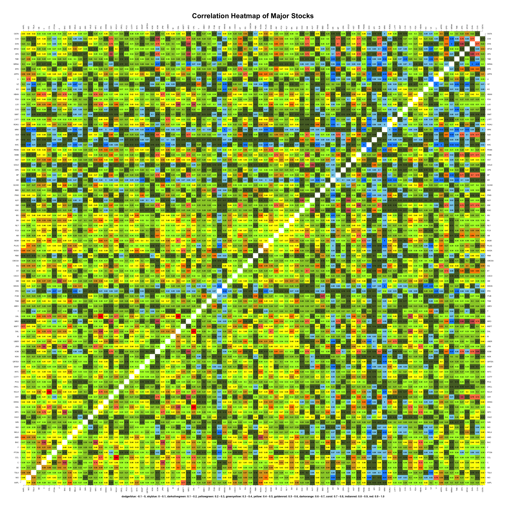
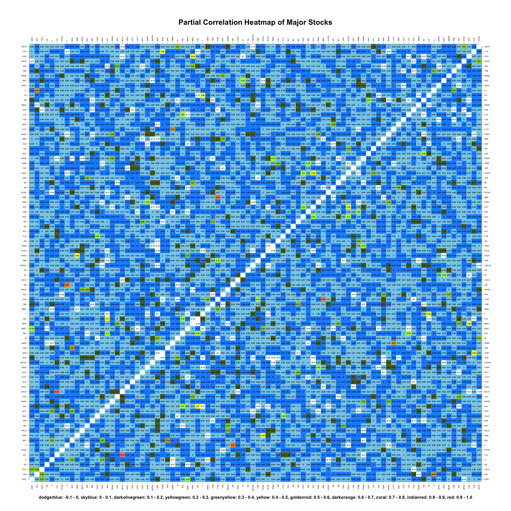
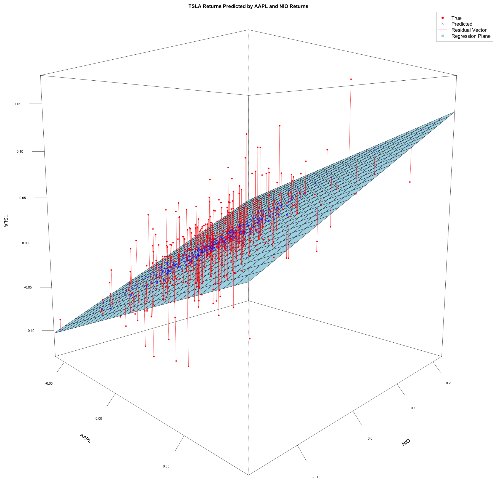

# Question 1

## Instructions

(10 points)

Random variables $U$, $V$, and $Z$ are uncorrelated and each have unit variance, and $X = U + aZ$, $Y = V + aZ$ where $a$ is a constant.

##### (a)

Prove that the Pearson correlation coefficient between $X$ and $Y$ is $\rho_{XY} = \frac{a^2}{1+a^2}$

##### (b)

Using Definition 2 from `Week5.pdf`, prove that the partial correlation coefficient between $X$ and $Y$ equals zero, $\rho_{XY|Z} = 0$ by the $3 \times 3$ matrix inverse.

## Solution

##### (a)

By definition, $\rho_{XY} = \frac{cov(X,Y)}{\sigma_X \sigma_Y}$. Let's solve for the covariance first.

$$
cov(X,Y) = cov(U + aZ, V + aZ) = cov(U,V) + cov(U, aZ) + cov(aZ, V) + cov(aZ, aZ)
$$

However, since $U$, $V$, and $Z$ are uncorrelated, we know that $cov(U,V) = cov(U, aZ) = cov(aZ, V) = 0$. Therefore, we can simplify the above equation to

$$
cov(X,Y) = cov(aZ, aZ) = a^2 \times cov(Z, Z) = a^2 \times var(Z, Z) = a^2 \sigma_Z^2
$$

Therefore, the correlation coefficient is

$$
\rho_{XY} = \frac{cov(X,Y)}{\sigma_X \sigma_Y} = \frac{a^2 \sigma_Z^2}{\sigma_X \sigma_Y}
$$

Let's find $\sigma_X$ and $\sigma_Y$. Let's first find $\sigma_X$.

$$
\sigma_X^2 = var(X) = var(U + aZ) = var(U) + var(aZ) = var(U) + a^2 var(Z) = \sigma_U^2 + a^2 \sigma_Z^2
$$

The step $var(U + aZ) = var(U) + var(aZ)$ was justified by the fact that $U$ and $aZ$ are uncorrelated.

Now, let's find $\sigma_Y$.

$$
\sigma_Y^2 = var(Y) = var(V + aZ) = var(V) + var(aZ) = var(V) + a^2 var(Z) = \sigma_V^2 + a^2 \sigma_Z^2
$$

Plugging back into the correlation coefficient equation, we get

$$
\rho_{XY} = \frac{a^2 \sigma_Z^2}{\sigma_X \sigma_Y} = \frac{a^2 \sigma_Z^2}{\sqrt{\sigma_X^2 \sigma_Y^2}} = \frac{a^2 \sigma_Z^2}{\sqrt{(\sigma_U^2 + a^2 \sigma_Z^2)(\sigma_V^2 + a^2 \sigma_Z^2)}}
$$

Because $U$, $V$, and $Z$ have unit variance, $\sigma_U^2 = \sigma_V^2 = \sigma_Z^2 = 1$. Therefore, we can simplify the above equation to

$$
\rho_{XY} = \frac{a^2}{\sqrt{(1 + a^2)(1 + a^2)}} = \frac{a^2}{\sqrt{(1 + a^2)^2}} = \frac{a^2}{1 + a^2}
$$

##### (b)

Assuming the columns go $X$, $Y$, and $Z$, the correlation matrix and its inverse are

$$
R = \begin{bmatrix}
    1 & \rho_{XY} & \rho_{XZ} \\
    \rho_{XY} & 1 & \rho_{YZ} \\
    \rho_{XZ} & \rho_{YZ} & 1
\end{bmatrix}, \quad R^{-1} =
\begin{bmatrix}
    1 & \rho_{XY} & \rho_{XZ} \\
    \rho_{XY} & 1 & \rho_{YZ} \\
    \rho_{XZ} & \rho_{YZ} & 1
\end{bmatrix}^{-1} =
\begin{bmatrix}
    1 & \rho^{XY} & \rho^{XZ} \\
    \rho^{XY} & 1 & \rho^{YZ} \\
    \rho^{XZ} & \rho^{YZ} & 1
\end{bmatrix}
$$

Definition 2 states that

$$
\rho_{XY|Z} = - \frac{\rho^{XY}}{\sqrt{\rho^{XZ} \rho^{YZ}}}
$$

Therefore, in order for $\rho_{XY|Z} = 0$, we need $\rho^{XY} = 0$.

Let's start by computing the unknown entries of $R$, $\rho_{XZ}$ and $\rho_{YZ}$. Let's start with $\rho_{XZ}$.

$$
\rho_{XZ} = \frac{cov(X,Z)}{\sigma_X \sigma_Z} = \frac{cov(U + aZ, Z)}{\sigma_X \sigma_Z} = \frac{cov(U, Z) + cov(aZ, Z)}{\sigma_X \sigma_Z} = \frac{0 + a cov(Z, Z)}{\sigma_X \sigma_Z} = \frac{a \sigma_Z^2}{\sigma_X \sigma_Z} = \frac{a}{\sigma_X}
$$

The last step is justified by the fact that $\sigma_Z^2 = \sigma_Z = 1$. We can further simplify to

$$
\frac{a}{\sigma_X} = \frac{a}{\sqrt{\sigma_X^2}} = \frac{a}{\sqrt{\sigma_U^2 + a^2 \sigma_Z^2}} = \frac{a}{\sqrt{1 + a^2}}
$$

Next, let's find $\rho_{YZ}$.

$$
\rho_{YZ} = \frac{cov(Y,Z)}{\sigma_Y \sigma_Z} = \frac{cov(V + aZ, Z)}{\sigma_Y \sigma_Z} = \frac{cov(V, Z) + cov(aZ, Z)}{\sigma_Y \sigma_Z} = \frac{0 + a cov(Z, Z)}{\sigma_Y \sigma_Z} = \frac{a \sigma_Z^2}{\sigma_Y \sigma_Z} = \frac{a}{\sigma_Y}
$$

We can further simplify to

$$
\frac{a}{\sigma_Y} = \frac{a}{\sqrt{\sigma_Y^2}} = \frac{a}{\sqrt{\sigma_V^2 + a^2 \sigma_Z^2}} = \frac{a}{\sqrt{1 + a^2}}
$$

We therefore have

$$
\rho_{YZ} = \rho_{XZ} = \frac{a}{\sqrt{1 + a^2}}
$$

Next, lets write $R^{-1}$ with the adjoint matrix, $adj(R)$

$$
R^{-1} = \frac{1}{det(R)} adj(R)
$$

The adjoint matrix $adj(R)$ is given by

$$
adj(R) = \begin{bmatrix}
    cof(R_{11}) & cof(R_{21}) & cof(R_{31}) \\
    cof(R_{12}) & cof(R_{22}) & cof(R_{32}) \\
    cof(R_{13}) & cof(R_{23}) & cof(R_{33})
\end{bmatrix}
$$

Where $cof(R_{ij})$ is the cofactor of the entry in the $i$th row and $j$th column of $R$. The cofactor is defined as

$$
cof(R_{ij}) = (-1)^{i+j} det(M_{ij})
$$

Where $M_{ij}$ is the matrix obtained by removing the $i$th row and $j$th column from $R$.

Let's find $cof(R_{12})$, as that will coincide to the $\rho^{XY}$ entry in $R^{-1}$.

$$
cof(R_{12}) = (-1)^{1+2} det(M_{12}) = -\begin{vmatrix}
    \rho_{XY} & \rho_{XZ} \\
    \rho_{YZ} & 1
\end{vmatrix} = -(\rho_{XY} - \rho_{XZ} \rho_{YZ})
$$

Substituting in the values we found for $\rho_{XY}$, $\rho_{XZ}$, and $\rho_{YZ}$, we get

$$
cof(R_{12}) = -(\frac{a^2}{1 + a^2} - \frac{a}{\sqrt{1 + a^2}} \times \frac{a}{\sqrt{1 + a^2}}) = -1(\frac{a^2}{1 + a^2} - \frac{a^2}{1 + a^2}) = 0
$$

Because $cof(R_{12}) = 0$, the entry in the second row and first column of $adj(R) = 0$, and therefore the entry in the second row and first column of $R^{-1} = 0$. Therefore, $\rho^{XY} = 0$. Because $\rho^{XY} = 0$, we can conclude that $\rho_{XY|Z} = 0$.

# Question 2

## Instructions

(15 points)

##### (a)

Use stock prices from `Most active stocks prices_Feb_01.2023.csv` to compute and display the correlation heatmap using $12$ breaks from $-0.1$ to $1$ with the respective colors from `Rcolor.pdf`. Save the graphs in the pdf format (ensure all stock symbols and labels are seen by choosing the appropriate graph size, e.g., height = width = 50 inches).

##### (b)

Report pairs of stocks with $r > 0.9$. Print out the symbols and the rounded correlation coefficient.

## Solution

##### (a) & (b)

Here is the code I used to generate the correlation heatmap and report the stocks with correlation $r > 0.9$. I chose to make the diagonal entries in the correlation matrix `NA` in order to make the heatmap more readable, and so they wouldn't be reported back as having high correlations.

```r
### Reading Data ###

data <- read.csv("./exams/midterm/data/Most active stocks prices_Feb_01.2023.csv")

data <- data[, -1] # remove date column

# Define column names and number of columns
names <- colnames(data)
num_names <- length(names)

# Convert data to a matrix
data_matrix <- as.matrix(data)
num_rows <- nrow(data_matrix)

# Convert daily prices to daily returns
data_matrix <- log(data_matrix[2:num_rows, ] / data_matrix[1:(num_rows - 1), ])

### Part A ###

# Define the correlation matrix
cor_matrix <- cor(data_matrix)

# Set the diagonal to NA
diag(cor_matrix) <- NA

# Define breaks and colors
breaks <- seq(-0.1, 1, length.out = 12)
colors <- c(
    "dodgerblue", "skyblue", "darkolivegreen",
    "yellowgreen", "greenyellow", "yellow", "goldenrod",
    "darkorange", "coral", "indianred", "red"
)
color_string <- "dodgerblue: -0.1 - 0, skyblue: 0 - 0.1, darkolivegreen: 0.1 - 0.2,
yellowgreen: 0.2 - 0.3, greenyellow: 0.3 - 0.4, yellow: 0.4 - 0.5, goldenrod: 0.5 - 0.6,
darkorange: 0.6 - 0.7, coral: 0.7 - 0.8, indianred: 0.8 - 0.9, red: 0.9 - 1.0"

# Open a PDF device
pdf("./exams/midterm/plots/q2.pdf", width = 50, height = 50)

# Define the margins
par(mar = c(10, 10, 15, 10))

# Create the heatmap
image(
    1:num_names, 1:num_names, cor_matrix,
    col = colors,
    breaks = breaks, xlab = "", ylab = "", axes = FALSE,
    main = "Correlation Heatmap of Major Stocks", cex.main = 4
)

# Label the axes
axis(1, at = 1:num_names, labels = names, las = 2, cex.axis = 1)
axis(2, at = 1:num_names, labels = names, las = 2, cex.axis = 1)
axis(3, at = 1:num_names, labels = names, las = 2, cex.axis = 1)
axis(4, at = 1:num_names, labels = names, las = 2, cex.axis = 1)

# Add correlation text to cells
for (i in 1:num_names) {
    text(
        rep(i, num_names), 1:num_names,
        round(cor_matrix[i, ], 2),
        font = 2, cex = 1
    )
}

# Add color key
mtext(side = 1, color_string, line = 5, cex = 1.5, font = 2)

# Close the PDF device
dev.off()

### Part B ###

# Initialize an empty list to store the stock pairs with r > 0.9
high_corr_pairs <- list()

# Iterate through the correlation matrix and find pairs with r > 0.9
for (i in 1:(num_names - 1)) {
    for (j in (i + 1):num_names) {
        if (cor_matrix[i, j] > 0.9) {
            high_corr_pairs <- c(
                high_corr_pairs,
                list(c(names[i], names[j], round(cor_matrix[i, j], 2)))
            )
        }
    }
}

# Print the stock pairs with r > 0.9
cat("Pairs of stocks with r > 0.9:\n")
for (pair in high_corr_pairs) {
    cat(pair[1], "and", pair[2], "with r =", pair[3], "\n")
}
```

Running the code generates a pdf of the heatmap and prints the following to the console:

```bash
Pairs of stocks with r > 0.9:
CCL and NCLH with r = 0.92
AAL and UAL with r = 0.91
DAL and UAL with r = 0.91
```

Carnival Corporation and Norwegian Cruise Line Holdings, American Airlines Group and United Airlines Holdings, and Delta Air Lines and United Airlines Holdings have correlation coefficients greater than 0.9. This makes sense as each pair of stocks are in the same industry, and therefore are likely to be correlated.

Below is a PNG of the heatmap.



# Question 3

## Instructions

(10 points)

The same as above, but create a partial correlation matrix heatmap (use the same breaks). Summarize the findings by comparison of ordinary and partial correlations

## Solution

Below is the code I used to generate the partial correlation heatmap. It is very similar to the previous question, except it uses an inverse correlation matrix to find the partial correlation matrix.

```r
### Reading Data ###

data <- read.csv("./exams/midterm/data/Most active stocks prices_Feb_01.2023.csv")

data <- data[, -1] # remove date column

# Define column names and number of columns
names <- colnames(data)
num_names <- length(names)

# Convert data to a matrix
data_matrix <- as.matrix(data)
num_rows <- nrow(data_matrix)

# Convert daily prices to daily returns
data_matrix <- log(data_matrix[2:num_rows, ] / data_matrix[1:(num_rows - 1), ])

# Define the correlation matrix
cor_matrix <- cor(data_matrix)

# Define an inverse correlation matrix
inv_cor_matrix <- solve(cor_matrix)

# Define an empty matrix to store partial correlations
partial_cor_matrix <- matrix(NA, nrow = num_names, ncol = num_names)

# Fill in the partial correlation matrix
for (i in 1:num_names) {
    for (j in 1:num_names) {
        partial_cor_matrix[i, j] <- -inv_cor_matrix[i, j] / sqrt(
            inv_cor_matrix[i, i] * inv_cor_matrix[j, j]
        )
    }
}

# Set the diagonal to NA
diag(partial_cor_matrix) <- NA

# Define breaks and colors
breaks <- seq(-0.1, 1, length.out = 12)
colors <- c(
    "dodgerblue", "skyblue", "darkolivegreen",
    "yellowgreen", "greenyellow", "yellow", "goldenrod",
    "darkorange", "coral", "indianred", "red"
)
color_string <- "dodgerblue: -0.1 - 0, skyblue: 0 - 0.1, darkolivegreen: 0.1 - 0.2, yellowgreen: 0.2 - 0.3, greenyellow: 0.3 - 0.4, yellow: 0.4 - 0.5, goldenrod: 0.5 - 0.6, darkorange: 0.6 - 0.7, coral: 0.7 - 0.8, indianred: 0.8 - 0.9, red: 0.9 - 1.0"

# Open a PDF device
pdf("./exams/midterm/plots/q3.pdf", width = 50, height = 50)

# Define the margins
par(mar = c(10, 10, 15, 10))

# Create the heatmap
image(
    1:num_names, 1:num_names, partial_cor_matrix,
    col = colors,
    breaks = breaks, xlab = "", ylab = "", axes = FALSE,
    main = "Partial Correlation Heatmap of Major Stocks", cex.main = 4
)

# Label the axes
axis(1, at = 1:num_names, labels = names, las = 2, cex.axis = 1)
axis(2, at = 1:num_names, labels = names, las = 2, cex.axis = 1)
axis(3, at = 1:num_names, labels = names, las = 2, cex.axis = 1)
axis(4, at = 1:num_names, labels = names, las = 2, cex.axis = 1)

# Add correlation text to cells
for (i in 1:num_names) {
    text(
        rep(i, num_names), 1:num_names,
        round(partial_cor_matrix[i, ], 2),
        font = 2, cex = 1
    )
}

# Add color key
mtext(side = 1, color_string, line = 5, cex = 1.5, font = 2)

# Close the PDF device
dev.off()

# Initialize an empty list to store the stock pairs with r > 0.6
high_corr_pairs <- list()

# Iterate through the correlation matrix and find pairs with r > 0.6
for (i in 1:(num_names - 1)) {
    for (j in (i + 1):num_names) {
        if (partial_cor_matrix[i, j] > 0.6) {
            high_corr_pairs <- c(
                high_corr_pairs,
                list(c(names[i], names[j], round(partial_cor_matrix[i, j], 2)))
            )
        }
    }
}

# Print the stock pairs with r > 0.6
cat("Pairs of stocks with r > 0.6:\n")
for (pair in high_corr_pairs) {
    cat(pair[1], "and", pair[2], "with r =", pair[3], "\n")
}
```

Running the code generates a pdf of the heatmap and prints the following to the console:

```bash
Pairs of stocks with r > 0.6:
CCL and NCLH with r = 0.76
F and GM with r = 0.63
ITUB and BBD with r = 0.74
```

It is easy to see that the partial correlations are smaller than the ordinary correlations. This is because the partial correlation between two variables is the correlation between those two variables after removing the effect of all other variables. Therefore, the partial correlation is a measure of the strength of the relationship between two variables after removing the effect of all other variables, and will therefore be smaller than the ordinary correlation.

There were three stock pairs with ordinary correlation $> 0.9$, and three stock pairs with partial correlation $> 0.6$. The maximum ordinary correlation was $0.92$, and the maximum partial correlation was $0.76$.

Below is a PNG of the heatmap.



# Question 4

## Instructions

(15 points)

##### (a)

Regress TESLA returns on returns of all other companies and extract only the companies with the p-value regression coefficient $< 0.001$ to obtain a parsimonious regression (print out summary).

##### (b)

Look online to understand why these companies have the most significant regression coefficients (write 1-2 sentences as an explanation).

##### (c)

Why is the coefficient of determination for a parsimonious regression is smaller than for the full model (provide a proof)?

##### (d)

Use the 3D plot to display the point returns with TESLA on the Z-axis. Use `par(mfrow=c(1,1),mar=c(1,1,3,1), cex.lab=1.5, cex.main=1.5)` and `ticktype = "detailed"` option in `persp()`.

## Solution

### Code

Here is the code I used to generate the parsimonious regression and 3D plot.

```r
### Reading Data ###

data <- read.csv("./exams/midterm/data/Most active stocks prices_Feb_01.2023.csv")

data <- data[, -1] # remove date column

# Convert daily prices to daily returns
data <- log(data[2:nrow(data), ] / data[1:(nrow(data) - 1), ])

### Part A ###

# Create model regressing TSLA on all other stocks
model <- lm(TSLA ~ ., data = data)

# Define alpha
alpha <- 0.001

# Extract companies with p-values less than alpha
significant_companies <- names(
    coef(summary(model))[, "Pr(>|t|)"]
)[coef(summary(model))[, "Pr(>|t|)"] < alpha]

# Create a new model with only significant companies
parsimonious_model <- lm(
    TSLA ~ .,
    data = data[, c("TSLA", significant_companies)]
)

# Print the summary of the parsimonious model
summary(parsimonious_model)

### Part D ###

# Create the grid for the regression plane
x <- seq(min(data$AAPL), max(data$AAPL), length.out = 25)
y <- seq(min(data$NIO), max(data$NIO), length.out = 25)
grid <- expand.grid(x, y)
colnames(grid) <- c("AAPL", "NIO")

# Calculate the z values for the regression plane
grid$TSLA <- predict(parsimonious_model, newdata = grid)

# Convert the grid to a matrix format for plotting
z <- matrix(grid$TSLA, nrow = 25, ncol = 25)

# Define the z limits
zlim <- c(min(data$TSLA), max(data$TSLA))

# Open a PNG device
png("./exams/midterm/plots/q4.png", width = 1800, height = 1800)

# Set the graphical parameters
par(mfrow = c(1, 1), mar = c(1, 1, 3, 1), cex.lab = 1.5, cex.main = 1.5)

# Create the 3D plot
plot_3d <- persp(x, y, z, xlab = "AAPL", ylab = "NIO", zlab = "TSLA", zlim = zlim, theta = 45, phi = 8, ticktype = "detailed", col = "lightblue", main = "TSLA Returns Predicted by AAPL and NIO Returns")

# Define the true points
points_true <- trans3d(
    x = data$AAPL, y = data$NIO, z = data$TSLA,
    pmat = plot_3d
)

# Define the predicted points
tsla_pred <- predict(parsimonious_model, newdata = data[, c("AAPL", "NIO")])
points_pred <- trans3d(
    x = data$AAPL, y = data$NIO, z = tsla_pred,
    pmat = plot_3d
)

# Plot the residual vectors
segments(
    x0 = points_pred$x, y0 = points_pred$y, z0 = points_pred$z,
    x1 = points_true$x, y1 = points_true$y, z1 = points_true$z,
    col = "red", lwd = 1
)

# Plot the predicted points
points(
    x = points_pred$x, y = points_pred$y, z = points_pred$z,
    pch = 4, col = "blue", cex = 1
)

# Plot the true points
points(
    x = points_true$x, y = points_true$y, z = points_true$z,
    pch = 16, col = "red", cex = 1
)

# Add a legend
legend(
    "topright",
    legend = c(
        "True TSLA Return", "Predicted TSLA Return",
        "Residual Vector", "Regression Plane"
    ),
    col = c("red", "blue", "red", "lightblue"),
    pch = c(16, 4, NA, 15),
    lwd = c(NA, NA, 1, NA),
    cex = 1.5
)


# Close the PNG device
dev.off()
```

##### (a)

Here is the printed summary of the parsimonious regression.

```bash
Call:
lm(formula = TSLA ~ ., data = data[, c("TSLA", significant_companies)])

Residuals:
     Min       1Q   Median       3Q      Max
-0.11012 -0.01509 -0.00098  0.01595  0.10007

Coefficients:
             Estimate Std. Error t value Pr(>|t|)
(Intercept) 0.0001603  0.0012586   0.127    0.899
AAPL        0.7979070  0.0732702  10.890   <2e-16 ***
NIO         0.3228584  0.0279373  11.557   <2e-16 ***
---
Signif. codes:  0 ‘***’ 0.001 ‘**’ 0.01 ‘*’ 0.05 ‘.’ 0.1 ‘ ’ 1

Residual standard error: 0.02871 on 520 degrees of freedom
Multiple R-squared:  0.4722,	Adjusted R-squared:  0.4702
F-statistic: 232.6 on 2 and 520 DF,  p-value: < 2.2e-16
```

##### (b)

The stocks AAPL and NIO are significant predictors of the returns of TSLA likely due to their presence in related industries. Apple is a major technology company that has shown interest in the electric vehicle market, while NIO is a direct competitor to Tesla in the EV industry. The strong correlation between these stocks and TSLA's stock price can be attributed to their shared exposure to similar market forces and trends in the electric vehicle and technology sectors.

##### (c)

The full model containing all stocks has a coefficient of determination of $0.6153$, whereas the parsimonious model has a coefficient of determination of $0.4722$. Here is the proof that the coefficient of determination for a parsimonious regression must be less than that of the full model:

Keep in mind that our coefficient of determination is defined as

$$
R^2 = 1 - \frac{SSR}{SST}
$$

where $SSR$ is the sum of squared residuals and $SST$ is the total sum of squares.

We know that the coefficient of determination of a regression with $n$ predictors is the same as the coefficient of determination of a regression with $n + 1$ predictors if $x_{n + 1} \perp r, x_1, x_2, \dots, x_n$ where $x_i$ is the $i^{th}$ predictor and $r$ is the residual vector. This is because the minimized ordinary least squares error given by $min||y - \boldsymbol{\beta} \bold{x}||^2$, which minimizes the $SSR$, is the same for both regressions.

However, if $x_{n + 1} \not\perp r, x_1, x_2, \dots, x_n$, then the minimized ordinary least squares error for the regression with $n + 1$ predictors will be smaller than for the regression with $n$ predictors, as $x_{n + 1}$ contributes to explaining the variability in $y$. Therefore, in the $\not\perp$ case, the $SSR$ will be smaller for the regression with $n + 1$ predictors than for the regression with $n$ predictors, and thus the coefficient of determination will be larger for the regression with $n + 1$ predictors than for the regression with $n$ predictors.

We therefore reach the conclusion that $R^2_n \leq R^2_{n + 1}$, where $R^2_n$ is the coefficient of determination for a regression with $n$ predictors and $R^2_{n + 1}$ is the coefficient of determination for a regression with $n + 1$ predictors. Note that $R^2_n = R^2_{n + 1}$ only in the orthogonal case described above.

In the case of comparing our full model to our parsimonious model, we know that the predictors in the full model are not orthogonal to each other predictor, as we can see from several high pairwise correlations in the correlation matrices in questions 2 and 3. Therefore, since the full model adds non-orthogonal predictors to the parsimonious model, the coefficient of determination for the parsimonious cannot be equal to the coefficient of determination for the full model. We can therefore conclude that

$$
R^2_{parsimonious} < R^2_{full}
$$

##### (d)

Below is the 3D plot of the predicted TSLA returns using the parsimonious model.



# Question 5

## Instructions

(10 extra points)

Create a running window movie by estimating the correlation matrix on a three- month period/window starting from the first date (use `png` to save the frames). Display the first and the last period of the running window using `mtext(side=3)`. Don’t display anything but the image itself. Summarize your finding by running the movie. [Hint: Borrow the animation technique from the `cdf.dyn` code]

## Solution

Here is the code I used to generate the running window movie.

```r
### Reading Data ###

data <- read.csv("./exams/midterm/data/Most active stocks prices_Feb_01.2023.csv")

data <- data[, -1] # remove date column

# Define column names and number of columns
names <- colnames(data)
num_names <- length(names)

window <- 90 # 90 days

# Define breaks and colors
breaks <- seq(-0.4, 1, length.out = 15)
colors <- c(
    "blue3", "blue", "dodgerblue2",
    "dodgerblue", "skyblue", "darkolivegreen",
    "yellowgreen", "greenyellow", "yellow", "goldenrod",
    "darkorange", "coral", "indianred", "red"
)
color_string <- "blue3: (-0.4) - (-0.3), blue: (-0.3) - (-0.2), dodgerblue2: (-0.2) - (-0.1), dodgerblue: (-0.1) - 0.0, skyblue: 0.0 - 0.1, darkolivegreen: 0.1 - 0.2, yellowgreen: 0.2 - 0.3, greenyellow: 0.3 - 0.4, yellow: 0.4 - 0.5, goldenrod: 0.5 - 0.6, darkorange: 0.6 - 0.7, coral: 0.7 - 0.8, indianred: 0.8 - 0.9, red: 0.9 - 1.0"


# Start at the window'th day
for (day in window:nrow(data)) {
    # Get the data for the window
    data_window <- data[(day - window + 1):day, ]

    # Convert data to a matrix
    data_matrix <- as.matrix(data_window)
    num_rows <- nrow(data_matrix)

    # Convert daily prices to daily returns
    data_matrix <- log(data_matrix[2:num_rows, ] / data_matrix[1:(num_rows - 1), ])

    # Define the correlation matrix
    cor_matrix <- cor(data_matrix)

    # Set the diagonal to NA
    diag(cor_matrix) <- NA

    # Open a PNG device
    png(
        paste("./exams/midterm/plots/q5_frames/frame_", day, ".png", sep = ""),
        width = 3500, height = 3500
    )

    # Define the margins
    par(mar = c(12, 10, 15, 10))

    # Create the heatmap
    image(
        1:num_names, 1:num_names, cor_matrix,
        col = colors,
        breaks = breaks, xlab = "", ylab = "", axes = FALSE,
        main = paste("Correlation Heatmap of Major Stocks (Calculated from Day ", day - window + 1, " to Day ", day, ")", sep = ""),
        cex.main = 4.5
    )

    # Label the axes
    axis(1, at = 1:num_names, labels = names, las = 2, cex.axis = 1.25)
    axis(2, at = 1:num_names, labels = names, las = 2, cex.axis = 1.25)
    axis(3, at = 1:num_names, labels = names, las = 2, cex.axis = 1.25)
    axis(4, at = 1:num_names, labels = names, las = 2, cex.axis = 1.25)

    # Add correlation text to cells
    for (i in 1:num_names) {
        text(
            rep(i, num_names), 1:num_names,
            round(cor_matrix[i, ], 2),
            font = 2, cex = 1
        )
    }

    # Add color key
    mtext(side = 1, color_string, line = 8, cex = 2, font = 2)

    # Close the PNG device
    dev.off()
}

# Create the animation

library(gifski)

frames <- list.files("./exams/midterm/plots/q5_frames/",
    pattern = ".png",
    full.names = TRUE
)

gifski(
    frames,
    gif_file = "./exams/midterm/plots/q5.gif",
    width = 1000, height = 1000,
    delay = 0.1
)
```

Overall, the `.gif` shows that the pairwise correlation appears to increase over the time period analyzed.

Below are some frames from the `.gif` to demonstrate the overall increase in pairwise correlations. The frames include the correlations calculated from data from day $1$ to day $90$, day $91$ to $180$, day $181$ to $270$, day $271$ to $360$ and from day $361$ to day $450$, respecitively. You can download the full `.gif` [here](https://drive.google.com/file/d/14Jv8BxsClj_4w3shv57oqfR_tRuJoEZO/view?usp=sharing).

{width=20%}
{width=20%}
{width=20%}
{width=20%}
{width=20%}
