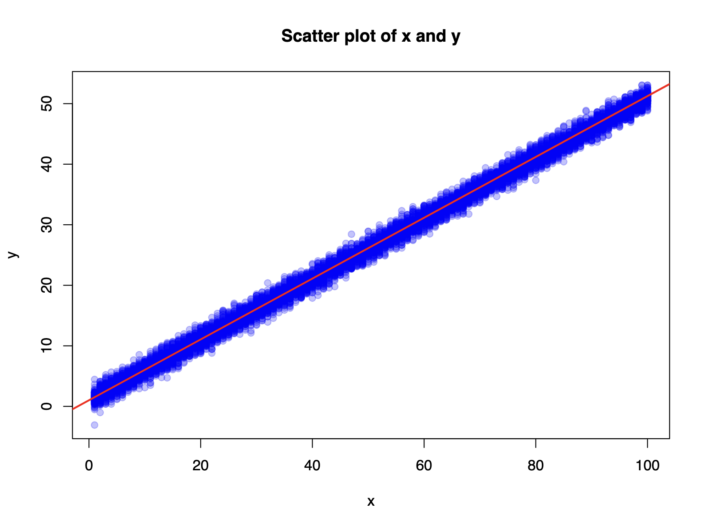
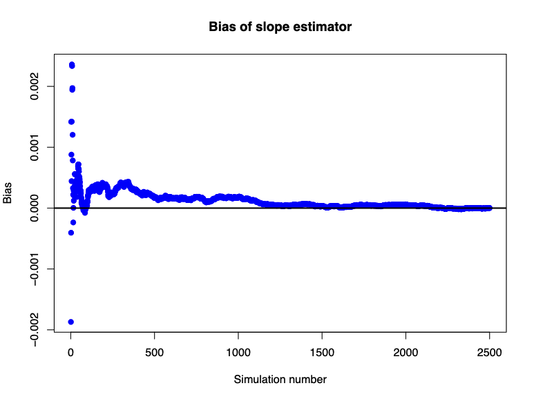
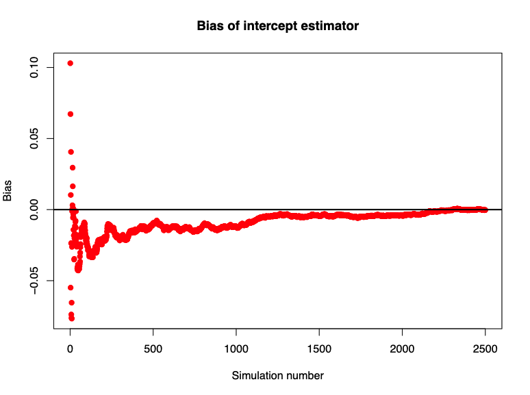

# M70 Homework 1

## Alex Craig

## Part 1. Finding unbiased estimators for $\alpha$ and $\beta$

In order to find the unbiased estimators for $\alpha$ and $\beta$ in the slope model with intercept $y = \alpha 1 + \beta x$, we need to find the minimum of the squared distance between the points and the plane described by the model. We can do this by taking the derivative of the distance with respect to $\alpha$ and $\beta$ and setting them equal to zero to find our unbiased estimators. We can then solve for the minimum of the distance by using our unbiased estimators in the distance equation.

Let's start by expanding the squared distance, which is given by the squared magnitude of the vector from a point's y value to plane's y value. Keep in mind that $n$ is the number of observations.

$$
distance^2 = ||y - \beta x - \alpha 1||^2 = (y - \beta x - \alpha 1)^T(y - \beta x - \alpha 1)
$$

$$
= y^T y - y^T \beta x - y^T \alpha 1 - \beta x^T y + \beta^2 x^T x + \beta x^T \alpha 1 - \alpha 1^T y + \alpha 1^T \beta x + \alpha^2 1^T 1
$$

$$
= y^T y - 2 \beta y^T x + \beta^2 x^T x - 2 \alpha y^T 1 + 2 \beta \alpha x^T 1 + \alpha^2 1^T 1
$$

$$
= ||y||^2 - 2 \beta y^T x + \beta^2 ||x||^2 - 2 \alpha y^T 1 + 2 \beta \alpha x^T 1 + \alpha^2 n
$$

### Unbiased estimator for $\alpha$

To find our estimation for $\alpha$, which we will call $\hat{\alpha}$, we take the derivative with respect to $\alpha$ and set it equal to zero.

$$
\frac{\partial}{\partial \alpha} distance^2 = -2 y^T 1 + 2 \beta x^T 1 + 2 \hat{\alpha} n = 0
$$

$$
\Rightarrow \hat{\alpha} = \frac{y^T 1 - \beta x^T 1}{n}
$$

$$
\Rightarrow \hat{\alpha} = \frac{n \bar{y} - \beta n \bar{x}}{n}
$$

$$
\Rightarrow \hat{\alpha} = \bar{y} - \beta \bar{x}
$$

### Unbiased estimator for $\beta$

To find our estimation for $\beta$, which we will call $\hat{\beta}$, we take the derivative with respect to $\beta$ and set it equal to zero. We should also substitute in the value for $\hat{\alpha}$ that we found above.

$$
\frac{\partial}{\partial \beta} distance^2 = -2y^T x + 2 \hat{\beta} ||x||^2 + 2 \hat{\alpha} x^T 1 = 0
$$

$$
= -y^T x +  \hat{\beta} ||x||^2 +  (\bar{y} - \hat{\beta} \bar{x}) x^T 1
$$

$$
= -y^T x + \hat{\beta} ||x||^2 + \bar{y} x^T 1 - \hat{\beta} \bar{x} x^T 1
$$

$$
\Rightarrow \hat{\beta} = \frac{y^T x - \bar{y} x^T 1}{||x||^2 - \bar{x} x^T 1}
$$

$$
\Rightarrow \hat{\beta} = \frac{y^T x - n \bar{y} \bar{x}}{||x||^2 - n \bar{x}^2}
$$

## Part 2. Finding the minimum distance

To find the minimum distance between a point and the plane, we can use the unbiased estimators that we found in part 1. We can then substitute these values into the distance equation to find the minimum distance.

$$
distance_{min} = ||y - \hat{\beta} x - \hat{\alpha} 1|| = ||y - \hat{\beta} x - (\bar{y} - \hat{\beta} \bar{x})1||
$$

$$
= ||y - \hat{\beta} x - \bar{y} 1 + \hat{\beta} \bar{x} 1||
$$

$$
= ||y - \bar{y} 1 - \hat{\beta} (x - \bar{x} 1)||
$$

## Part 3. Demonstrating estimators to be unbiased through simulation

In order to demonstrate that our estimators are unbiased, we can simulate the process of finding the estimators with `n` observations `nSim` times and then take the average of the estimators from all of these simulations to see if they are close to the true values of $\alpha$ and $\beta$.

### Simulating the process in `R`

This process has been implemented in `R` below. The function `simSlopeIntercept` takes in the true values of $\alpha$ and $\beta$, the standard deviation of the error term, the number of observations, and the number of simulations to run. It then simulates the process of finding the estimators `nSim` times and returns the average of the estimators.

```r
# Function: simSlopeIntercept
# Description: Simulates the slope and intercept of a
#       linear regression model
# Inputs:
#   b_true: the true slope of the linear regression model
#   a_true: the true intercept of the linear regression model
#   sigma: the standard deviation of the error term
#   n: the number of observations
#   nSim: the number of simulations to run
# Outputs:
#   sim_mean_b: the simulated mean of the slope estimate
#   sim_mean_a: the simulated mean of the intercept estimate
#   scatterplot.pdf: a scatterplot of the simulated data
#       with the regression line
#   bias_slope.pdf: a scatterplot of the bias of the
#       slope estimate
#   bias_intercept.pdf: a scatterplot of the bias of the
#       intercept estimate

simSlopeIntercept <- function(
    b_true = 0.5,
    a_true = 1,
    sigma = 1,
    n = 100,
    nSim = 1000) {
    x <- 1:n
    x_magnitude_sq <- sum(x^2)
    x_bar <- mean(x)

    b_hat <- rep(NA, nSim)
    a_hat <- rep(NA, nSim)

    x_scatterplot_vals <- rep(x, nSim) # x values for scatterplot
    y_scatterplot_vals <- rep(NA, nSim * n) # y values for scatterplot

    x_bias_vals <- 1:nSim # x values for bias plots
    b_hat_bias <- rep(NA, nSim) # y values for bias plots
    a_hat_bias <- rep(NA, nSim) # y values for bias plots

    for (i in 1:nSim) {
        eps <- rnorm(n, sd = sigma) # error term
        y <- a_true + (b_true * x) + eps # y values with error term
        y_scatterplot_vals[((i * n) - n + 1):(i * n)] <-
            y # add y values to scatterplot
        y_bar <- mean(y) # mean of y values
        scalar_prod_xy <- sum(x * y) # scalar product of x and y

        b_hat[i] <- (scalar_prod_xy - (n * y_bar * x_bar)) /
            (x_magnitude_sq - (n * x_bar^2)) # unbiased estimator of b
        a_hat[i] <- y_bar - (b_hat[i] * x_bar) # unbiased estimator of a

        b_hat_bias[i] <- mean(b_hat[1:i]) - b_true # bias of b_hat
        # estimator up to i
        a_hat_bias[i] <- mean(a_hat[1:i]) - a_true # bias of a_hat
        # estimator up to i
    }

    sim_mean_b <- mean(b_hat) # simulated mean of b_hat
    sim_mean_a <- mean(a_hat) # simulated mean of a_hat

    # Plot the scatterplot
    pdf("./homeworks/hw1/plots/scatterplot.pdf", width = 8, height = 6)
    plot(x_scatterplot_vals, y_scatterplot_vals,
        main = "Scatter plot of x and y", xlab = "x", ylab = "y",
        pch = 19, col = "#0000ff3c"
    )
    abline(sim_mean_a, sim_mean_b, col = "red", lwd = 2)
    dev.off()

    # Plot a scatterplot of the bias of the slope and intercept estimates.
    # Slope estimate is blue, intercept estimate is red.
    pdf("./homeworks/hw1/plots/bias_slope.pdf", width = 8, height = 6)
    plot(x_bias_vals, b_hat_bias,
        main = "Bias of slope estimator",
        xlab = "Simulation number", ylab = "Bias", pch = 19, col = "blue"
    )
    abline(h = 0, col = "black", lwd = 2)
    dev.off()

    pdf("./homeworks/hw1/plots/bias_intercept.pdf", width = 8, height = 6)
    plot(x_bias_vals, a_hat_bias,
        main = "Bias of intercept estimator",
        xlab = "Simulation number", ylab = "Bias", pch = 19, col = "red"
    )
    abline(h = 0, col = "black", lwd = 2)
    dev.off()

    # Print the results
    cat(
        "\nSimulated mean of b_hat (slope estimate):", sim_mean_b,
        "\nTrue value of b (slope):", b_true,
        "\n\nSimulated mean of a_hat (intercept estimate):", sim_mean_a,
        "\nTrue value of a (intercept):", a_true
    )
}

simSlopeIntercept(nSim = 2500)
```

Executing the above code gives the following output:

```bash
[Running] Rscript "/Users/alexcraig/projects/r-projects/
    math-70/homeworks/hw1/hw1.r"

Simulated mean of b_hat (slope estimate): 0.5000004
True value of b (slope): 0.5

Simulated mean of a_hat (intercept estimate): 0.9997873
True value of a (intercept): 1
[Done] exited with code=0 in 4.525 seconds
```

We can see that the averaged simulated mean after many simulations of the slope and intercept estimate is very close to the true value of the slope and intercept. This demonstrates that our estimators are unbiased.

### Plotting the simulated data

Let's look at the scatter plot of the simulated data. The red line is the line $y = \hat{\alpha} + \hat{\beta} x$. `nSim = 100` for the scatter plot in order for the plot to be more readable.



### Plotting bias of estimators

We can also plot the bias of the estimators as a function of the number of simulations. We can compare the difference between the true value of the slope and intercept and the average prediction of each estimator after each simulation. If the estimators are unbiased, this difference should converge to 0. The `b_hat_bias` and `a_hat_bias` variables keep track of these differences. In order to visualize this convergence, we can plot the bias of each estimator as a function of the number of simulations. It is clear that the bias of both estimators converge to 0 as the number of simulations increases, demonstrating that the estimators are unbiased.



