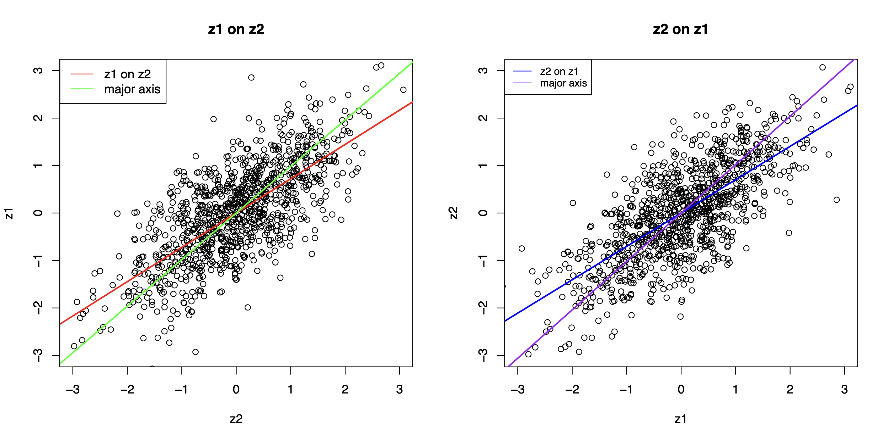
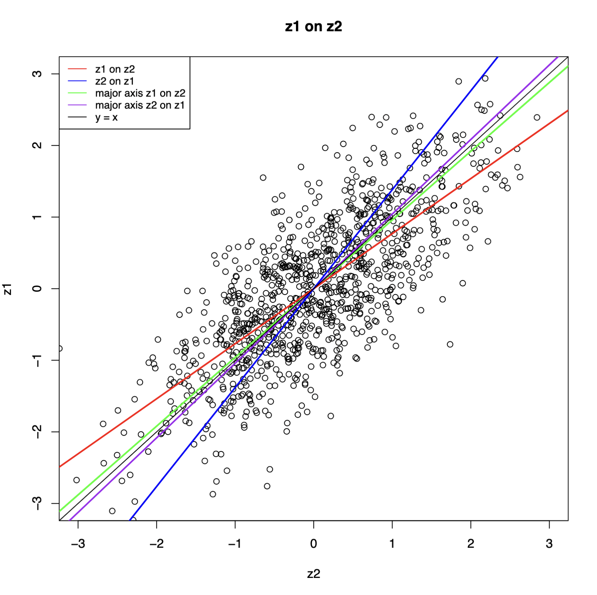

# Math 70 Homework 2

## Alex Craig

## Part 1.

**Instructions:** Generate $z_1$ and $z_2$ as above and graph the scatter plot. Compute and show the regression lines $z_1$ on $z_2$, $z_2$ on $z_1$, and the major principle axis. Print out the four slopes and explain the results.

### 1.1 Methods

Below is an `R` scripts that generates $z_1$ and $z_2$, plots the scatter plot, and outputs the slopes of the two regressions and major principals axes. Because $z_1$ comes from a standard normal distribution, and $z_2$ is standardized to a standard normal distribution, I chose not to include an estimation for the intercept of either regression line, because we would expect it to be zero anyways. I estimated the slope of the regression line using $\beta = \frac{\bold{y}^T \bold{x}}{||x||^2}$ where $\bold{y}$ is the independent variable and $\bold{x}$ is the independent variable. This is an unbiased estimator for the slope, $\beta$ when the intercept is zero.

I similarly chose to not include an estimator for the intercept of the major principal axis. Because both $z_1$ and $z_2$ are standard normal, we would expect the ellipse surrounding their points to be centered at the origin, because that is where the mean of $z_1$ and $z_2$ will be, and so the major principal axis of that ellipse would pass through the origin. I estimated the slope of the major principal axis using the eigenvectors of the covariance matrix of $z_1$ and $z_2$. Because the covariance matrix was generated in the form of $z_1$ on $z_2$, I had to flip the components of the maximal eigenvector in order to calculate the slope of the major principal axis for $z_2$ on $z_1$.

### 1.2 Code

```r
# generate z1 and z2
n <- 1000
z1 <- rnorm(n)
z2 <- z1 + rnorm(n)
# normalize z2 (z1 is already normalized)
z2 <- z2 / sd(z2)

### REGRESSIONS ###

# Manual computation of the regression lines
scalar_prod_z1_z2 <- sum(z1 * z2)
z1_sq_norm <- sum(z1^2)
z2_sq_norm <- sum(z2^2)

# compute beta (slope) for z1 on z2 and z2 on z1
beta_z1_z2 <- scalar_prod_z1_z2 / z2_sq_norm
beta_z2_z1 <- scalar_prod_z1_z2 / z1_sq_norm

### MAJOR AXIS ###

# compute the n x n covariance matrix of each entry of z1 and z2
# define a matrix with z1 and z2 as columns
# first column is z1, second column is z2
z1_z2 <- cbind(z1, z2)

# compute the covariance matrix
# the covariance matrix is 2x2 & symmetric
omega <- cov(z1_z2)

cat("\n\n")
omega

# compute the eigenvalues and eigenvectors of the covariance matrix
eigenvalues <- eigen(omega)$values
eigenvectors <- eigen(omega)$vectors

cat("\n\n")
eigenvalues
cat("\n")
eigenvectors

# compute the major axis vector
largest_eigenvector_index <- which(eigenvalues == max(eigenvalues))
major_axis_vector <- eigenvectors[, largest_eigenvector_index]

cat("\n\nMajor Axis Vector: ", major_axis_vector)

# compute the slope of the major axis
# omega is in the form of z1 on z2
major_axis_slope_z1_z2 <- major_axis_vector[2] / major_axis_vector[1]
major_axis_slope_z2_z1 <- major_axis_vector[1] / major_axis_vector[2]

### PRINT RESULTS ###

cat("\n\nRegression Results:")
cat("\n--------------------")

# z1 on z2
cat("\nz1 on z2: y = ", beta_z1_z2, "* x")
# major axis
cat("\n\nz1 on z2 major axis: y = ", major_axis_slope_z1_z2, "* x")

# z2 on z1
cat("\n\nz2 on z1: y = ", beta_z2_z1, "* x")
# major axis
cat("\n\nz2 on z1 major axis: y = ", major_axis_slope_z2_z1, "* x")

cat("\n--------------------\n\n")

### PLOT ###

# graph a scatterplot of z1 and z2
pdf("./homeworks/hw2/plots/scatter.pdf", width = 12, height = 6)

# Set up a two-panel plot
par(mfrow = c(1, 2))

# Plot 1: Plot z1 on z2 with the regression line
plot(
    z2, z1,
    xlab = "z2", ylab = "z1", main = "z1 on z2",
    xlim = c(-3, 3), ylim = c(-3, 3)
)
abline(0, beta_z1_z2, col = "red", lwd = 2)
# Plot the major axis
abline(0, major_axis_slope_z1_z2, col = "green", lwd = 2)
# Legend
legend("topleft",
    legend = c("z1 on z2", "major axis"),
    col = c("red", "green"), lty = 1
)

# Plot 2: Plot z2 on z1 with the regression line
plot(
    z1, z2,
    xlab = "z1", ylab = "z2", main = "z2 on z1",
    xlim = c(-3, 3), ylim = c(-3, 3)
)
abline(0, beta_z2_z1, col = "blue", lwd = 2)
# Plot the major axis
abline(0, major_axis_slope_z2_z1, col = "purple", lwd = 2)
# Legend
legend("topleft",
    legend = c("z2 on z1", "major axis"),
    col = c("blue", "purple"), lty = 1, cex = 0.8
)

# Close the PDF device
dev.off()

pdf("./homeworks/hw2/plots/scatter_combined.pdf", width = 8, height = 8)

# Plot 3: Plot z1 on z2 with the major axis
plot(z2, z1,
    xlab = "z2", ylab = "z1", main = "z1 on z2",
    xlim = c(-3, 3), ylim = c(-3, 3)
)
abline(0, major_axis_slope_z1_z2, col = "green", lwd = 2)
abline(0, 1 / major_axis_slope_z1_z2, col = "purple", lwd = 2)
# Plot the regression lines
abline(0, beta_z1_z2, col = "red", lwd = 2)
abline(0, 1 / beta_z2_z1, col = "blue", lwd = 2)
abline(0, 1, col = "black", lwd = 1)
# Legend
legend("topleft",
    legend = c(
        "z1 on z2", "z2 on z1", "major axis z1 on z2",
        "major axis z2 on z1", "y = x"
    ),
    col = c(
        "red", "blue", "green",
        "purple", "black"
    ), lty = 1, cex = 0.8
)

# Close the PDF device
dev.off()
```

Running this code outputs the follow in the `PRINT RESULTS` section:

```bash
Regression Results:
--------------------
z1 on z2: y =  0.722738 * x

z1 on z2 major axis: y =  0.9807017 * x

z2 on z1: y =  0.7025935 * x

z2 on z1 major axis: y =  1.019678 * x
--------------------
```

The code also outputs scatter plots of $z_1$ on $z_2$ and $z_2$ on $z_1$, and a combined plot of both. When graphing the combined plot, the reciprocals of the slopes of the $z_2$ on $z_1$ regression line and major axis are plotted because $z_2$ is used as the independent variable on the combined plot.



{ width=400px height=400px }

### 1.3 Results

**Initial Thoughts:**

When graphing the combined plot, it appears that the slopes of the regression and major principal axis for $z_1$ on $z_2$ are a reflection over the line $y=x$ of their $z_2$ on $z_1$ counterparts. It also appears that the slopes of both major principal axes are very close to the line $y=x$.

**Regression Results:**

The slopes for the two regression lines and the major principal axes are the result of the relationship between $z_1$ and $z_2$. As we have seen from the scatter plots, there is a clear positive linear relationship between the two variables. This relationship is represented by the slopes of the regression lines: $0.722738$ for $z_1$ on $z_2$ and $0.7025935$ for $z_2$ on $z_1$. The similarity of these slopes indicates a strong relationship between $z_1$ and $z_2$, as expected, since $z_2$ is generated as a function of $z_1$. This similarity is not surprising because, looking at out estimator for $\beta$, we see that the slope of the regression line should be the same regardless of which variable is used as the independent variable assuming both variables are standard normal. Also, the similarity of the slopes suggests that the relationship between $z_1$ and $z_2$ is symmetrical.

**Symmetry of the Relationship:**

This symmetrical nature of the relationship between $z_1$ and $z_2$ can be attributed to the fact that they are both standardized normal random variables with the same variance and from the way $z_2$ is generated as a function of $z_1$. The relationship between the two variables is such that a change in one variable has a corresponding and proportional change in the other variable

**Major Principal Axis Results:**

The slopes of the major principal axes are very close to the line $y=x$, with values of $0.9807017$ for $z_1$ on $z_2$ and $1.019678$ for $z_2$ on $z_1$. This is to be expected since both $z_1$ and $z_2$ are standardized normal random variables with the same variance where $z_2$ has a linear relationship with $z_1$, so we would expect the ellipse surrounding the data points to have a major principal axis along the line $y=x$. As the number of observations increases, the major principal axis will converge to the line $y=x$.

**Combined Plot:**

When looking at the combined scatter plot, it is interesting to observe that the slopes of the regression and major principal axis for $z_1$ on $z_2$ are a reflection over the line $y=x$ of their $z_2$ on $z_1$ counterparts. This occurs because of the symmetrical nature of the relationship between $z_1$ and $z_2$, which is due to their standardized normal random variable properties. The reciprocals of the slopes for $z_2$ on $z_1$ provide the corresponding slopes for $z_1$ on $z_2$. This relationship is also evident in the graph, where the slopes of the regression lines and major principal axes for both variables are reflections of each other across the $y=x$ line.

**Conclusion:**

In conclusion, the results of the analysis show a strong linear relationship between $z_1$ and $z_2$ and that the ellipse surrounding the data points has a major principal axis close to the 45-degree line. The reflection of slopes across the $y=x$ line in the combined plot further emphasizes the symmetrical nature of the relationship between the two variables, which can be attributed to their standardized normal random variable properties.

## Part 2.

**Instructions:** Prove that $\bold{A}^{1/2}$, $\bold{A}^{-1}$, and $\bold{A}^{-1/2}$ derived through the matrix function meet their definitions.

If $\bold{A}$ is a symmetric matrix with spectral decomposition $\bold{A} = \bold{P}\bold{\Lambda}\bold{P}^{-1}$, then

$$
f(\bold{A}) = \bold{P}f(\bold{\Lambda})\bold{P}^{T}
$$

Keep in mind that matrix $\bold{P}$ is orthogonal, so $\bold{P}^{T} = \bold{P}^{-1}$, so $\bold{P}^T \bold{P} = \bold{P} \bold{P}^T = \bold{I}$.

### 2.1 Proving $\bold{A}^{1/2}$ Meets Definition

By definition, $\bold{A}^{1/2} \bold{A}^{1/2} = \bold{A}$. Lets prove this identity through the matrix function.

$$
\bold{A}^{1/2} \bold{A}^{1/2} = \bold{P}\bold{\Lambda^{1/2}}\bold{P}^{T} \bold{P}\bold{\Lambda^{1/2}}\bold{P}^{T} = \bold{P}\bold{\Lambda^{1/2}} \bold{I} \bold{\Lambda^{1/2}}\bold{P}^{T}
$$

$$
= \bold{P}\bold{\Lambda}\bold{P}^{T} = \bold{A}
$$

### 2.2 Proving $\bold{A}^{-1}$ Meets Definition

By definition, $\bold{A} \bold{A}^{-1} = \bold{I}$. Lets prove this identity through the matrix function.

$$
\bold{A} \bold{A}^{-1} = \bold{P}\bold{\Lambda}\bold{P}^{T} \bold{P}\bold{\Lambda^{-1}}\bold{P}^{T} = \bold{P}\bold{\Lambda} \bold{I} \bold{\Lambda^{-1}}\bold{P}^{T} = \bold{P}\bold{I}\bold{P}^{T} = \bold{I}
$$

$\bold{A}^{-1} \bold{A} = \bold{I}$ is also true.

$$
\bold{A}^{-1} \bold{A} = \bold{P}\bold{\Lambda^{-1}}\bold{P}^{T} \bold{P}\bold{\Lambda}\bold{P}^{T} = \bold{P}\bold{\Lambda^{-1}} \bold{I} \bold{\Lambda}\bold{P}^{T} = \bold{P}\bold{I}\bold{P}^{T} = \bold{I}
$$

### 2.3 Proving $\bold{A}^{-1/2}$ Meets Definition

By definition, $\bold{A}^{-1/2} \bold{A}^{-1/2} = \bold{A}^{-1}$. Lets prove this identity through the matrix function.

$$
\bold{A}^{-1/2} \bold{A}^{-1/2} = \bold{P}\bold{\Lambda^{-1/2}}\bold{P}^{T} \bold{P}\bold{\Lambda^{-1/2}}\bold{P}^{T} = \bold{P}\bold{\Lambda^{-1/2}} \bold{I} \bold{\Lambda^{-1/2}}\bold{P}^{T} = \bold{P}\bold{\Lambda^{-1}}\bold{P}^{T} = \bold{A}^{-1}
$$

## Part 3.

**Instructions:** Prove that $\frac{\partial ||\bold{x}||}{\partial \bold{x}} = \frac{\bold{x}}{||\bold{x}||}$.

$||\bold{x}||$ is the norm of $\bold{x}$ and can be defined as the square root of the scalar product of $\bold{x}$ with itself. Thus

$$
||\bold{x}|| = \sqrt{\bold{x}^T \bold{x}}
$$

We can then differentiate this expression with respect to $\bold{x}$.

$$
\frac{\partial ||\bold{x}||}{\partial \bold{x}} = \frac{\partial \sqrt{\bold{x}^T\bold{x}}}{\partial \bold{x}}
$$

Apply chain rule

$$
\frac{\partial \sqrt{\bold{x}^T\bold{x}}}{\partial \bold{x}} = \frac{1}{2\sqrt{\bold{x}^T\bold{x}}} \frac{\partial (\bold{x}^T\bold{x})}{\partial \bold{x}}
$$

Apply the identity $\frac{\partial (\bold{x}^T \bold{A} \bold{x})}{\partial \bold{x}} = 2 \bold{A} \bold{x}$

$$
\frac{\partial (\bold{x}^T\bold{x})}{\partial \bold{x}} = \frac{\partial (\bold{x}^T \bold{I} \bold{x})}{\partial \bold{x}} = 2 \bold{I} \bold{x} = 2\bold{x}
$$

$$
\Rightarrow \frac{1}{2\sqrt{\bold{x}^T\bold{x}}} \frac{\partial (\bold{x}^T\bold{x})}{\partial \bold{x}} = \frac{1}{2\sqrt{\bold{x}^T\bold{x}}} 2\bold{x} = \frac{\bold{x}}{\sqrt{\bold{x}^T\bold{x}}} = \frac{\bold{x}}{||\bold{x}||}
$$

$$
\Rightarrow \frac{\partial ||\bold{x}||}{\partial \bold{x}} = \frac{\bold{x}}{||\bold{x}||}
$$
