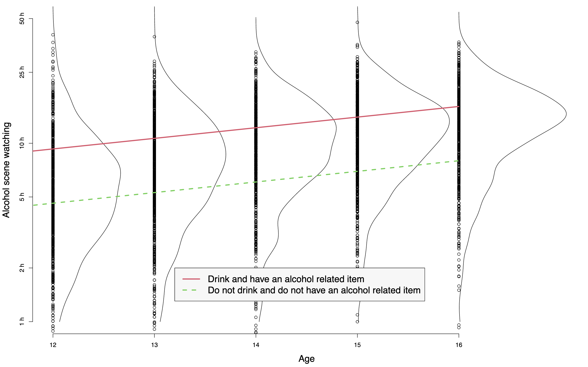
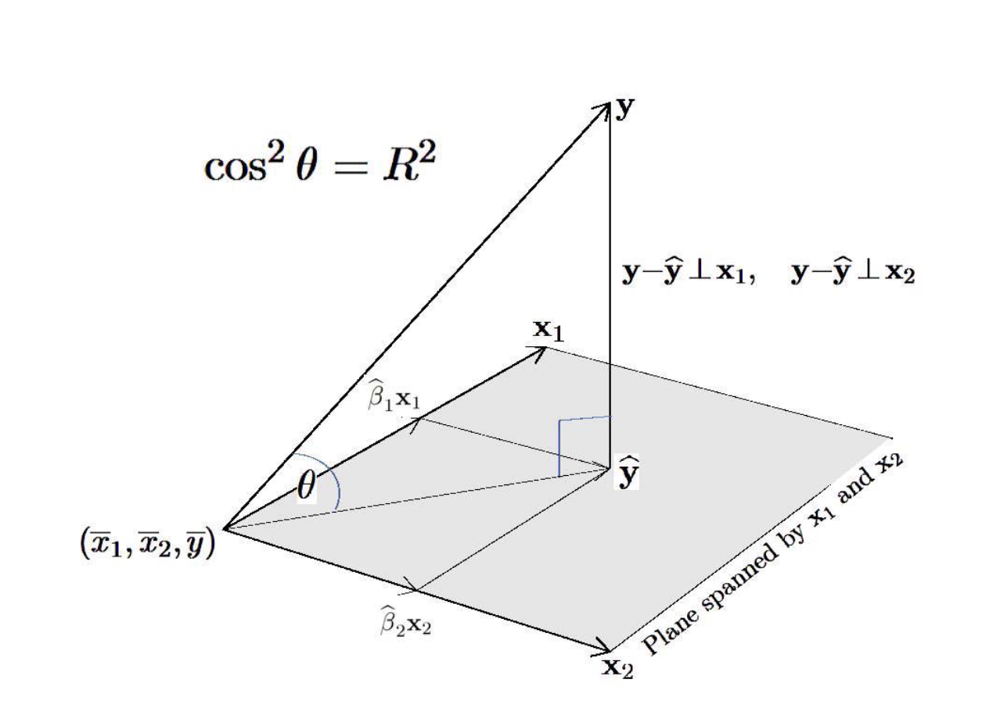
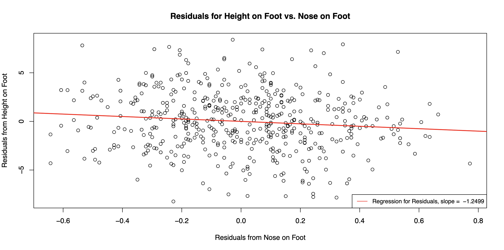

\centerline{\Large\bf Math 70 Homework 2}
\vspace{1em}
\centerline{\bf Alex Craig}
\vspace{3em}

## Part 1.

**Instructions:** Display the time of watching alcohol scenes as a function of age for a black girl who drinks, has an alcohol related item, with high income and high parents’ education, and has good grades as in function `kidsdrink(job=2)`. To contrast, display the same girl but who does not drink and does not have an alcohol related item. Compute, interpret, and display the effect of drinking and having an alcohol related item.

### 1.1 Code

Here is the code for the function `kidsdrink`:

```r
kidsdrink <-
    function(job = 1) {
        d <- read.csv("./homeworks/hw3/data/kidsdrink.csv", header = T)
        if (job == 1) {
            pdf("./homeworks/hw3/plots/kidsdrink_job1.pdf",
                width = 8, height = 10
            )
            par(
                mfrow = c(1, 1),
                mar = c(4.5, 4.5, 1, 1), cex.lab = 1.5
            )
            plot(d$age, d$alcm,
                type = "n",
                xlab = "Age", ylab = "Time of watching, hours"
            )
            for (a in 12:16)
            {
                da <- d$alcm[d$age == a]
                n <- length(da)
                points(rep(a, n), da)
                den <- density(da, from = 0)
                lines(a + 2.25 * den$y, den$x)
            }
        }
        if (job == 2) {
            d <- cbind(d, log(1 / 60^2 + d$alcm))
            names(d)[ncol(d)] <- "logalcm"
            # linear model
            o <- lm(logalcm ~ drink + age + boy + race
                + alcbr + pared + inc + grade, data = d)
            print(summary(o))
            pdf("./homeworks/hw3/plots/kidsdrink_job2.pdf",
                width = 16, height = 10
            )
            par(mfrow = c(1, 1), mar = c(4.5, 4.5, 1, 1), cex.lab = 1.5)
            alab <- c(1, 2, 5, 10, 25, 50)
            lalab <- log(alab)
            plot(
                d$age, d$logalcm,
                xlim = c(12, 17), ylim = range(lalab),
                type = "n", axes = F,
                xlab = "Age", ylab = "Alcohol scene watching"
            )
            axis(side = 1, 12:16)
            axis(side = 2, at = lalab, labels = paste(alab, "h"), srt = 90)
            for (a in 12:16) {
                da <- d$logalcm[d$age == a]
                n <- length(da)
                points(rep(a, n), da)
                den <- density(da, from = 0)
                lines(a + 1.25 * den$y, den$x)
            }
            x <- 11:16
            a <- coef(o)

            # black girl who drinks, has alcohol related item,
            # has parents with high education, has high income,
            # and has good grades
            lines(x, a[1] + a[2] + a[3] * x + a[6] + a[7], col = 2, lwd = 2)
            intercept_first <- a[1] + a[2] + a[3] * 12 + a[6] + a[7]

            # same black girl, except who doesn't drink
            # and doesn't have an alcohol related item
            lines(x, a[1] + a[3] * x + a[7], col = 3, lwd = 2, lty = 2)
            intercept_second <- a[1] + a[3] * 12 + a[7]

            cat("\nIntercept First:", intercept_first)
            cat("\nIntercept Second:", intercept_second)

            cat("\n\nAdjusted Intercept First:", exp(intercept_first))
            cat("\nAdjusted Intercept Second:", exp(intercept_second))

            cat(
                "\n\nAdjusted Intercept % Difference:",
                (exp(intercept_first) * 100 / exp(intercept_second) - 100)
            )

            legend(
                13.2, log(2),
                c(
                    "Drink and have an alcohol related item",
                    "Do not drink and do not have an alcohol related item"
                ),
                col = 2:3, lwd = 2, lty = 1:2, bg = "gray97", cex = 1.5
            )

            o <- lm(logalcm ~ age + boy + race +
                I(drink * alcbr) + pared + inc + grade, data = d)
        }
    }

kidsdrink(job = 2)
```

Running the code prints the following output:

```bash
[Running] Rscript "/Users/alexcraig/projects/r-projects/math-70/homeworks/hw3/R/kidsdrink.r"

Call:
lm(formula = logalcm ~ drink + age + boy + race + alcbr + pared +
    inc + grade, data = d)

Residuals:
     Min       1Q   Median       3Q      Max
-10.1467  -0.3481   0.0987   0.4663   2.1806

Coefficients:
             Estimate Std. Error t value Pr(>|t|)
(Intercept) -0.093682   0.133021  -0.704 0.481314
drink        0.432670   0.028335  15.270  < 2e-16 ***
age          0.137065   0.009459  14.490  < 2e-16 ***
boy          0.048303   0.024298   1.988 0.046895 *
race         0.266762   0.045818   5.822 6.29e-09 ***
alcbr        0.267472   0.040170   6.658 3.16e-11 ***
pared       -0.022162   0.027022  -0.820 0.412198
inc          0.084440   0.037931   2.226 0.026063 *
grade       -0.090740   0.025978  -3.493 0.000483 ***
---
Signif. codes:  0 ‘***’ 0.001 ‘**’ 0.01 ‘*’ 0.05 ‘.’ 0.1 ‘ ’ 1

Residual standard error: 0.7416 on 3796 degrees of freedom
Multiple R-squared:  0.1969,	Adjusted R-squared:  0.1952
F-statistic: 116.3 on 8 and 3796 DF,  p-value: < 2.2e-16


Intercept First: 2.22908
Intercept Second: 1.528938

Adjusted Intercept First: 9.291315
Adjusted Intercept Second: 4.613273

Adjusted Intercept % Difference: 101.404
[Done] exited with code=0 in 0.279 seconds
```

### 1.2 Methods

In order to display the time of watching alcohol related scenes as a function of age for the specified demographic, I adjusted the coefficients I was using in `lines` function calls at the end of the R code. The coefficients available are stored in the `a` variable, and are as follows:

1. `Intercept: -0.093682`
2. `drink: 0.432670` (0 if doesn't drinks, 1 if drinks)
3. `age: 0.137065`
4. `boy: 0.048303` (0 if girl, 1 if boy)
5. `race: 0.266762` (0 if nonwhite, 1 if white)
6. `alcbr: 0.267472` (0 if doesn't own alcohol related item, 1 if owns alcohol related item)
7. `pared: -0.022162` (0 if parents have low education, 1 if parents have high education)
8. `inc: 0.084440` (0 if high income, 1 if low income)
9. `grade: -0.090740` (0 if good grades, 1 if bad grades)

To display the time of watching alcohol scenes as a function of age for a black girl who drinks, has an alcohol-related item, with high income and high parents' education, and has good grades, I selected the `Intercept` coefficient and coefficients which are `1` for such a demographic. These included the coefficients for `Intercept`, `drink`, `alcbr`, and `pared`. I also included `age * x` as a term as a we are plotting the time of watching alcohol scenes as a function of age. The resulting line is then called as

```r
lines(x, a[1] + a[2] + a[3] * x + a[6] + a[7], col = 2, lwd = 2)
```

To display the time of watching alcohol scenes for the same girl, but who doesn't drink, I again selected the coefficients which are `1` for such a demographic. These coefficients are the same as the previous line, except they exclude `drink` and `alcbr`, and so only include `Intercept`, and `pared`. I also again included `age * x` as a term. The resulting line is then called as

```r
lines(x, a[1] + a[3] * x + a[7], col = 3, lwd = 2, lty = 2)
```

These two lines, one representing the black girl who drinks and has an alcohol-related item and the other representing the same girl who doesn't drink and doesn't own alcohol-related items, are plotted on the graph with different colors and line styles to distinguish them. This comparison allows you to visualize the effects of the factors of interest on the time of watching alcohol scenes for the specified black girl. The outputted plot is below.



### 1.3 Interpretation

We can see that out two lines have the same slope on a logarithmic scale, as for both lines the `age` coefficient, stored in `a[3]`, is the only coefficient multiplied by `x`. This means that the additional factors of interest, `drink`, and `alcbr` only serve into increase the logarithmic intercept of the linear regression predicting the time spent watching alcohol scenes as a function of age for the first girl (the one who drinks and has alcohol-related items) compared to the second girl. The question is then by how much does this intercept increase? We can see in our printed output, that the intercept for the first girl is `2.22908`, and the intercept for the second girl is `1.528938`. It is important to note that these intercepts are taken at `x = 12`, as that is the "intercept" we see on the plot, and that they are on a logarithmic scale. Because the lines have a consistent difference on a logarithmic scale, they will have a consistent percentage difference on a linear scale. Therefore taking the intercept at `x = 12` compared to a different `x` value won't affect the percentage difference in intercepts, which is the value we are interested in.

In order to get the percentage difference in intercepts at `x = 12`, we can transform them into a linear scale by calling `exp(intercept)`. We can see these adjusted intercepts are `9.291315` and `4.613273` for the first line and second line respectively. We can see in the R output that the percentage difference in these two values is `101.404`. This means that, given a black girl with educated parents, high income, and good grades, we would expect her to watch $101.404\%$ more alcohol scenes if she drinks and own alcohol-related items than if she doesn't drink and doesn't own alcohol-related items across all ages. On a big picture, this means that drinking and owning alcohol related items is highly associated with watching alcohol related scenes.

## Part 2.

**Instructions:** How do you find the most efficient estimator of the intercept in the multiple regression where the slopes are treated as a nuisance parameters (not a subject of interest)? Provide a proof.

Let $\boldsymbol{\hat{\beta}}$ be the OLS estimator for $\boldsymbol{\beta}$ defined as

$$
\boldsymbol{\hat{\beta}} = (\bold{X}^T\bold{X})^{-1}\bold{X}^T\bold{y}
$$

where

$$
\bold{X} = \begin{bmatrix} \bold{1} & \bold{x_1} & \dots & \bold{x_m} \end{bmatrix}
$$

Therefore $\hat{\beta}_1$ is the first component of $\boldsymbol{\hat{\beta}}$, and represents the OLS estimator for the intercept. $\hat{\beta}_1$ is an unbiased linear estimator with minimum variance. $\hat{\beta}_1$ is unbiased because all components of the OLS estimator are unbiased. $\hat{\beta}_1$ is a linear estimator because the OLS is a linear estimator. $\hat{\beta}_1$ has minimum variance because as follows:

Define $\bold{p}$ as

$$
\bold{p} = \begin{bmatrix} \bold{1} \quad \bold{0} \quad \dots \quad \bold{0} \end{bmatrix}^T
$$

And by the Gauss Markov Theorem,

$$
var(\hat{\beta}_1) = \bold{p}^T cov(\boldsymbol{\hat{\beta}}) \bold{p} \le \bold{p}^T cov(\boldsymbol{\tilde{\beta}}) \bold{p} = var(\tilde{\beta}_1)
$$

for any linear unbiased estimator $\tilde{\beta}_1$.

Therefore $\hat{\beta}_1$ is the most efficient estimator of the intercept.

## Part 3.

**Instructions:** Provide a geometric interpretation of the following fact: the coefficient of determination does not change if the new predictor is orthogonal to the previous set of predictors and the residual vector from the previous regression.

We can imagine a single predictor regression, where we estimate the value of $y$ as a function of $x_1$. Our prediction for $y$, defined by $\hat{y}_1$ is given by the projection of $y$ onto the line spanned by $x_1$. Our coefficient of determination is then given by $R^2 = cos^2\theta$, where $\theta$ is the angle between $y$ and the line spanned by $x_1$.

Now imagine we add a second predictor, $x_2$, which is orthogonal to both $x_1$ and our residual which is the vector from $y$ to $\hat{y}$. Our new prediction for $y$, defined as $\hat{y}_2$ is given by the projection of $y$ onto the plane spanned by $x_1$ and $x_2$. Our coefficient of determination is again given by $R^2 = cos^2\theta$, where $\theta$ is the angle between $y$ and the plane spanned by $x_1$ and $x_2$. However, because $x_2$ is orthogonal to both $x_1$ and our residual vector, $\hat{y}_1$ already lies on the plane spanned by $x_1$ and $x_2$, and thus the angle between $y$ and the plane spanned by $x_1$ and $x_2$ is the same as the angle between $y$ and the line spanned by $x_1$. Therefore, our coefficient of determination does not change. The same logic applies to higher dimensional spaces where $\hat{y}_n$ lies on the hyperplane spanned by $x_1, x_2, \dots, x_n, x_{n+1}$ assuming $x_{n+1}$ is orthogonal to $x_1, x_2, \dots, x_n$ and the residual vector from $y$ to $\hat{y}_n$.

This means that adding a predictor that is orthogonal to the previous set of predictors and the residual vector from the previous regression does not change the coefficient of determination, which means that adding suck a predictor does not change the amount of variance explained by the model.

The following image displays this scenario with two predictors.

{ width=400px height=400px }

## Part 4.

**Instructions:** Plot residuals from regression of Height on Foot versus residuals from regression of Nose on Foot. Explain the result in connection to the negative slope in the multiple regression of Height on Foot and Nose.

### 4.1 Code

Here is the code to plot the residuals from the regression of Height on Foot versus the residuals from the regression of Nose on Foot.

```r
# Load the data with column for height, foot length, and nose length
data <- read.csv("./homeworks/hw3/data/HeightFootNose.csv", header = T)
# Instantiate the regression model
regression <- lm(Height ~ Foot + Nose, data = data)
# Print the summary of the regression model
print(summary(regression))

plot_residuals <- function(data, regression) {
    # Plot the residuals
    pdf("./homeworks/hw3/plots/height_foot_nose_residuals.pdf",
        width = 12, height = 6
    )

    # Plot the residuals for height on foot no the residuals for nose on foot
    height_foot_regression <- lm(Height ~ Foot, data = data)
    nose_foot_regression <- lm(Nose ~ Foot, data = data)
    residuals_regression <- lm(
        residuals(height_foot_regression) ~ residuals(nose_foot_regression),
    )
    plot(
        residuals(nose_foot_regression), residuals(height_foot_regression),
        xlab = "Residuals from Nose on Foot",
        ylab = "Residuals from Height on Foot",
        main = "Residuals for Height on Foot vs. Nose on Foot"
    )
    abline(residuals_regression, col = "red", lwd = 2)
    legend(
        "bottomright",
        legend = c(paste("Regression for Residuals, slope = ", round(
            residuals_regression$coefficients[2],
            digits = 4
        ))),
        col = c("red"), lty = 1, cex = 0.8
    )

    # Close the PDF device
    dev.off()
}

plot_residuals(data, regression)
```

Running the code prints the following output:

```bash
[Running] Rscript "/Users/alexcraig/projects/r-projects/math-70/homeworks/hw3/R/part4.r"

Call:
lm(formula = Height ~ Foot + Nose, data = data)

Residuals:
    Min      1Q  Median      3Q     Max
-8.5211 -1.9269  0.0138  2.0121  8.3635

Coefficients:
            Estimate Std. Error t value Pr(>|t|)
(Intercept)  56.6307     1.2436  45.537   <2e-16 ***
Foot          1.6140     0.1017  15.874   <2e-16 ***
Nose         -1.2499     0.5125  -2.439   0.0151 *
---
Signif. codes:  0 ‘***’ 0.001 ‘**’ 0.01 ‘*’ 0.05 ‘.’ 0.1 ‘ ’ 1

Residual standard error: 3.048 on 494 degrees of freedom
Multiple R-squared:  0.3486,	Adjusted R-squared:  0.346
F-statistic: 132.2 on 2 and 494 DF,  p-value: < 2.2e-16

[Done] exited with code=0 in 0.238 seconds
```

The outputted plot is shown below.



### 4.2 Methods

This R code reads a CSV file containing data on height, foot length, and nose length. It then creates a regression model to predict height based on foot length and nose length. The summary of the regression model is printed.

Next, a function called 'plot_residuals' is defined to plot the residuals. This function first creates a PDF file to store the plot. It then performs two separate regression analyses: one for height on foot length and another for nose length on foot length. Residuals from both regressions are used to create a new regression model.

The function then creates a scatter plot of the residuals for height on foot length against the residuals for nose length on foot length, with the regression line for the residuals plotted in red. The slope of the regression line is printed in the legend, and we can see that this slope is `-1.499`, which is the exact same slope as our coefficient for nose length in the regression of height on foot length and nose length.

### 4.3 Interpretation

The negative slope of the regression in the scatter plot of the residuals means that, as a residual for nose on foot increases, the residual for height on foot decreases. If we think of keeping foot sized fixed, this means that a larger nose length is associated with a smaller height. This is because a larger true nose length for a given foot length will increase the residual for nose on foot. However, because the residual for nose on foot increased, we would expect the residual for height on foot to decrease according to the regression slope of `1.2499`. A decrease in the residual for height on foot when foot length is fixed implies that true height is smaller. This is consistent with the negative coefficient for nose length in the regression of height on foot length and nose length.
