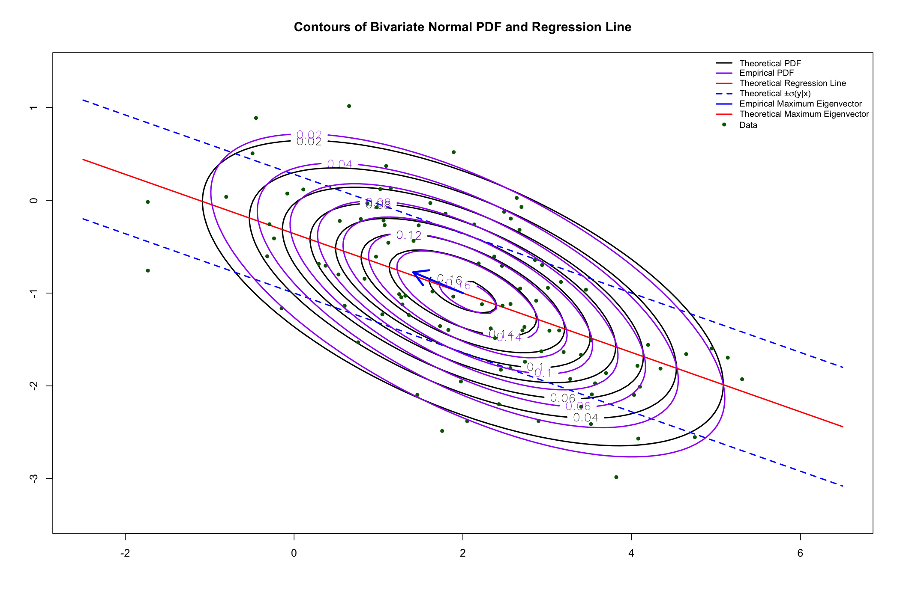

## Part 1.

### Instructions:

The bivariate normal distribution is given by $\mu_y = -1, \sigma_y = 0.8, \mu_x = 2, \sigma_x = 1.5$ and $\rho = -0.6$

(a) Use contour command to plot contours of the pdf.

(b) Add the regression line as the conditional mean of $Y$ on $X$ along with $\pm \sigma_{y|x}$ line.

(c) Generate 100 pairs from this distribution by generating marginal $X$ and then normally distributed conditional $Y$.

(d) Display the arrow with the maximum eigenvector at the center of the distribution.

(e) Add contours of the estimated $\boldsymbol{\Omega}$ computed by var with different color (use contour with option `add=T`).

### Solution:

#### 1.1 Methods

##### (a)

To create contours of the pdf, I wrote a `bivariate_normal_pdf()` function that takes in parameters `x`, `y`, `mu_x`, `mu_y`, and covariance matrix `cov_mat` and returns the bivariate density given by

$$
f(x,y;\boldsymbol{\mu},\boldsymbol{\Omega}) = \frac{1}{(2 \pi) \sigma_x \sigma_y \sqrt{1 - \rho^2}} e^{-\frac{1}{2(1 - \rho^2)}[(\frac{x - \mu_x}{\sigma_x})^2 - 2 \rho (\frac{x - \mu_x}{\sigma_x})(\frac{y - \mu_y}{\sigma_y}) + (\frac{y - \mu_y}{\sigma_y})^2]}
$$

I then used this function to calculate the probability density for each point in the grid and created a matrix of the probability density. I then plotted the contours of the bivariate normal pdf using the `contour()` function.

##### (b)

To add the regression line as the conditional mean of $Y$ on $X$ along with $\pm \sigma_{y|x}$ line, I wrote a `conditional_mean()` function that takes in parameters `x`, `mu_y`, `mu_x`, `sd_y`, `sd_x`, and `rho` and returns the conditional mean of $Y$ given $X$ given by

$$
E(Y|X = x) = \mu_y + \rho \frac{\sigma_y}{\sigma_x}(x - \mu_x)
$$

and derived form

$$
E(Y|X = x) = \mu_y + \boldsymbol{\omega}_{xy}^T \boldsymbol{\Omega}_{xx}^{-1} (x - \mu_x)
$$

which, in the bivariate case

$$
\boldsymbol{\omega}_{xy}^T = cov(X, Y) = \rho \sigma_x \sigma_y, \quad \boldsymbol{\Omega}_{xx}^{-1} = \frac{1}{\sigma_x^2}
$$

I then used this function to calculate the conditional mean of $Y$ given $X$ for each point in the grid and created matrices of the conditional mean and standard deviations. I then plotted the regression line and $\pm \sigma_{y|x}$ lines using the `lines()` function.

##### (c)

To generate 100 marginal $X$ values, I simply called `rnorm(sample_size, mean = mu_x, sd = sd_x)`. Then, to generate 100 conditional $Y$ values, I called `rnorm(sample_size, mean = y_conditional_mean, sd = y_conditional_sd)` where `y_conditional_mean` and `y_conditional_sd` are the conditional mean and standard deviation of $Y$ conditional on any given $X$, respectively. I then plotted the points using the `points()` function.

##### (d)

To display the arrow with the maximum eigenvector at the center of the distribution, I used the `eigen()` function inside a custom `getMaxEigenvector()` which accepts a matrix as a parameter to calculate the eigenvalues and eigenvectors of the theoretical covariance matrix. I then used the `arrows()` function to plot an arrow with the maximum eigenvector at the center of the distribution.

##### (e)

To add contours of the estimated $\boldsymbol{\Omega}$ computed by `var()` with different color, I used the `var()` function to calculate the empirical covariance matrix. I then calculate the probability density as I did in part a, but using the empirical covariance matrix instead of the theoretical covariance matrix. I then plotted the contours of the bivariate normal pdf using the `contour()` function, but with a different color.

#### 1.2 Code

```r
### Initial setup ###
png("./homeworks/hw4/plots/part1.png", width = 2100, height = 1400, res = 150)

# Bivariate normal distribution parameters
n <- 100
rho <- -0.6
mu_x <- 2
mu_y <- -1
sd_x <- 1.5
sd_y <- 0.8

# Calculate the covariance
cov_xy <- rho * sd_x * sd_y

# Create a covariance matrix of bivariate normal data
cov_mat <- matrix(c(sd_x^2, cov_xy, cov_xy, sd_y^2), nrow = 2, ncol = 2)

# Generate grid for plotting
x <- seq(mu_x - 3 * sd_x, mu_x + 3 * sd_x, length = n)
y <- seq(mu_y - 3 * sd_y, mu_y + 3 * sd_y, length = n)
grid <- expand.grid(x = x, y = y)

### Part A ###

# Bivariate normal pdf function
bivariate_normal_pdf <- function(x, y, mu_x, mu_y, cov_mat) {
    sd_x <- sqrt(cov_mat[1, 1])
    sd_y <- sqrt(cov_mat[2, 2])
    z_1 <- (x - mu_x) / sd_x
    z_2 <- (y - mu_y) / sd_y
    rho <- cov_mat[1, 2] / (sd_x * sd_y)
    exponent <- (-1 / (2 * (1 - rho^2))) * (z_1^2 - 2 *
        rho * z_1 * z_2 + z_2^2)
    scaling_factor <- 1 / (2 * pi * sqrt(1 - rho^2) * sd_x * sd_y)
    return(scaling_factor * exp(exponent))
}

# Calculate the probability density for each point in the grid
grid$pdf_matrix <- bivariate_normal_pdf(grid$x, grid$y, mu_x, mu_y, cov_mat)

# Create a matrix of the probability density
pdf_matrix <- matrix(grid$pdf_matrix, nrow = n, ncol = n)

# Plot the contours of the bivariate normal pdf
contour(x, y, pdf_matrix,
    main = "Contours of Bivariate Normal PDF and Regression Line",
    lwd = 2,
    labcex = 1.15,
)

### Part B ###

# Calculate the conditional mean of Y given X
conditional_mean <- function(x, mu_y, mu_x, sd_y, sd_x, rho) {
    return(mu_y + rho * sd_y / sd_x * (x - mu_x))
}

# Calculate conditional standard deviation of Y given X
y_conditional_sd <- sqrt(sd_y^2 * (1 - rho^2))

# Calculate the regression line values
grid$conditional_mean <- conditional_mean(grid$x, mu_y, mu_x, sd_y, sd_x, rho)
grid$upper_sd <- grid$conditional_mean + y_conditional_sd
grid$lower_sd <- grid$conditional_mean - y_conditional_sd

# Create matrices of conditional mean and standard deviations
mean_matrix <- matrix(grid$conditional_mean, nrow = n, ncol = n)
upper_sd_matrix <- matrix(grid$upper_sd, nrow = n, ncol = n)
lower_sd_matrix <- matrix(grid$lower_sd, nrow = n, ncol = n)

# Plot the regression line and +/- standard deviations
lines(x, grid$conditional_mean[1:length(x)], col = "red", lwd = 2)
lines(x, grid$upper_sd[1:length(x)], col = "blue", lwd = 2, lty = 2)
lines(x, grid$lower_sd[1:length(x)], col = "blue", lwd = 2, lty = 2)

### Part C ###

# Generate marginal X
sample_size <- 100
X <- rnorm(sample_size, mean = mu_x, sd = sd_x)

# Generate conditional Y
y_conditional_mean <- conditional_mean(X, mu_y, mu_x, sd_y, sd_x, rho)
Y <- rnorm(sample_size, mean = y_conditional_mean, sd = y_conditional_sd)

# Create a data frame of X and Y
data_xy <- data.frame(X, Y)

# Plot the data
points(data_xy$X, data_xy$Y, col = "darkgreen", pch = 20)

### Part D ###

# Compute the empirical covariance matrix
emp_cov_mat <- cov(data_xy)

getMaxEigenvector <- function(cov_mat) {
    # Calculate eigenvectors and eigenvalues of the covariance matrix
    eigen_decomp <- eigen(cov_mat)
    eigen_vectors <- eigen_decomp$vectors
    eigen_values <- eigen_decomp$values

    # Find the maximum eigenvalue and corresponding eigenvector
    max_eigenvalue_index <- which.max(eigen_values)
    max_eigenvalue <- eigen_values[max_eigenvalue_index]
    max_eigenvector <- eigen_vectors[, max_eigenvalue_index]

    # Scale the eigenvector to be magnitude of 1
    scaled_eigenvector <- max_eigenvector / sqrt(max_eigenvalue)

    return(scaled_eigenvector)
}

theoretical_max_eigenvector <- getMaxEigenvector(cov_mat)

# Calculate the start points of the arrows
theoretical_arrow_start_x <- mu_x
theoretical_arrow_start_y <- mu_y

# Calculate the end points of the arrows
theoretical_arrow_end_x <- theoretical_arrow_start_x +
    theoretical_max_eigenvector[1]
theoretical_arrow_end_y <- theoretical_arrow_start_y +
    theoretical_max_eigenvector[2]

arrows(theoretical_arrow_start_x, theoretical_arrow_start_y,
    theoretical_arrow_end_x, theoretical_arrow_end_y,
    col = "blue", lwd = 3
)

### Part E ###

# Calculate the probability density for each point
# using the empirical covariance matrix
grid$emp_pdf <- bivariate_normal_pdf(
    grid$x, grid$y, mean(X), mean(Y), emp_cov_mat
)

# Create a matrix of the probability density
emp_pdf_matrix <- matrix(grid$emp_pdf, nrow = n, ncol = n)

# Plot the contours of the bivariate normal pdf
contour(x, y, emp_pdf_matrix,
    add = TRUE, col = "purple", lwd = 2,
    labcex = 1.15
)

# Add a legend
legend("topright",
    legend = c(
        "Theoretical PDF", "Empirical PDF",
        "Theoretical Regression Line",
        expression(paste("Theoretical ±", sigma, "(y|x)")),
        "Empirical Maximum Eigenvector", "Theoretical Maximum Eigenvector",
        "Data"
    ),
    col = c(
        "black", "purple", "red",
        "blue", "blue", "red", "darkgreen"
    ), lty = c(1, 1, 1, 2), cex = 0.8,
    pch = c(NA, NA, NA, NA, NA, NA, 16),
    lwd = c(2, 2, 2, 2, 2, 2, NA), bty = "n"
)

# Close the png
dev.off()
```

#### 1.3 Plot

Below is the resulting plot generated by the R script.



## Part 2.

### Instructions:

The average covid rates at six towns are $(2.1, 1.7, 1.0, 1.8, 1.5, 1.2)$ with SD = $0.1$. The GPS town locations are $(70.1, 34.3), (70.4, 35.2), (69.3, 36.2), (72.5, 35.8), (71.2, 33.8), (68.7, 34.5)$. A covid outbreak is detected in town #2: the rate raised to $4.1$. Assuming that the spatial correlation between towns $i$ and $j$ is modeled as $e^{-0.2d_{ij}}$ where $d_{ij}$ is the distance, what is the expected $95\%$ confidence interval for the rate of covid in town $6$? Make other necessary plausible assumptions if needed.

### Solution:

#### 2.1 Finding Expectation and Variance

Let us define a vector of initial covid rates for all towns besides town $6$ $\boldsymbol{\mu}_x$ which we assume are the mean rates of each town, a vector of updated covid rates $\bold{x}$ for all towns besides town $6$, and a scalar $\sigma$ which is the initial standard deviation of covid rates in each town as

$$
\boldsymbol{\mu}_x = \begin{bmatrix} 2.1 \\ 1.7 \\ 1.0 \\ 1.8 \\ 1.5 \end{bmatrix}, \quad \bold{x} = \begin{bmatrix} 2.1 \\ 4.1 \\ 1.0 \\ 1.8 \\ 1.5 \end{bmatrix}, \quad \sigma = \sigma_x = \sigma_y = 0.1
$$

Next, let us define a scalar $\mu_y$ as the mean covid rate of town $6$ which we assume is the initial covid rate.

$$
\mu_y = 1.2
$$

Next, let us define a matrix of distances between all towns $\bold{D}$, and another matrix of spatial correlations between all towns $\bold{R}$, where $\bold{R}_{ij} = e^{-0.2\bold{D}_{ij}}$

$$
\bold{D} = \begin{bmatrix}
0 & 0.9486833 & 2.061553 & 2.830194 & 1.208305 & 1.414214 \\
0.9486833 & 0 & 1.486607 & 2.184033 & 1.612452 & 1.838478 \\
2.061553 & 1.486607 & 0 & 3.224903 & 3.061046 & 1.802776 \\
2.830194 & 2.184033 & 3.224903 & 0 & 2.385372 & 4.016217 \\
1.208305 & 1.612452 & 3.061046 & 2.385372 & 0 & 2.596151 \\
1.414214 & 1.838478 & 1.802776 & 4.016217 & 2.596151 & 0 \\
\end{bmatrix}
$$

$$
\bold{R} = \begin{bmatrix}
1 & 0.8271769 & 0.6621186 & 0.56777 & 0.7853224 & 0.7536383 \\
0.8271769 & 1 & 0.7428053 & 0.6460964 & 0.724343 & 0.6923279 \\
0.6621186 & 0.7428053 & 1 & 0.5246727 & 0.5421519 & 0.6972891 \\
0.56777 & 0.6460964 & 0.5246727 & 1 & 0.6205963 & 0.447874 \\
0.7853224 & 0.724343 & 0.5421519 & 0.6205963 & 1 & 0.5949784 \\
0.7536383 & 0.6923279 & 0.6972891 & 0.447874 & 0.5949784 & 1 \\
\end{bmatrix}
$$

The $i^{th}$ column of $\bold{D}$ is the distance from town $i$ to all other towns. The $i^{th}$ column of $\bold{R}$ is the correlation between town $i$ and all other towns.

We are now trying to find the $95\%$ confidence interval for the rate of covid in town $6$, which we can define as $Y$. In order to find the confidence interval, we need to find the conditional mean and variance of $Y$. We may use the following formulas to find the conditional mean and variance of $Y$.

$$
E(Y|\bold{X} = \bold{x}) = \mu_y + \boldsymbol{\omega}_{yx}^T \boldsymbol{\Omega}_{xx}^{-1} (\bold{x} - \boldsymbol{\mu}_x), \quad var(Y|\bold{X} = \bold{x}) = \sigma_y^2 - (1 - \rho_{yx} ^ 2)
$$

where

$$
\boldsymbol{\omega}_{yx} = cov(Y, \bold{X}), \quad \rho_{yx}^2 = \sigma_y^{-2} \boldsymbol{\omega}_{yx} \boldsymbol{\Omega}_{xx}^{-1} \boldsymbol{\omega}_{yx}
$$

In this case we subset the first 5 rows and columns in order to get covariance between town $6$ and all other towns and the covariance matrix of all other towns besides town $6$.

$$
\boldsymbol{\omega}_{yx} = \begin{bmatrix} \sigma_x \bold{R}_{i6} \sigma_y \\ \vdots \end{bmatrix}, 1 \leq i \leq 5 =  \begin{bmatrix} \sigma^2 \bold{R}_{i6} \\ \vdots \end{bmatrix}, 1 \leq i \leq 5 =
\begin{bmatrix}
0.007536383 \\
0.006923279 \\
0.006972891 \\
0.00447874 \\
0.005949784 \\
\end{bmatrix}
$$

$$
\boldsymbol{\Omega}_{xx} = \boldsymbol{\Lambda}^{1/2} \bold{R}_{ij} \boldsymbol{\Lambda}^{1/2}, 1 \leq i, j \leq 5 =
\begin{bmatrix}
0.01 & 0.008271769 & 0.006621186 & 0.0056777 & 0.007853224 \\
0.008271769 & 0.01 & 0.007428053 & 0.006460964 & 0.00724343 \\
0.006621186 & 0.007428053 & 0.01 & 0.005246727 & 0.005421519 \\
0.0056777 & 0.006460964 & 0.005246727 & 0.01 & 0.006205963 \\
0.007853224 & 0.00724343 & 0.005421519 & 0.006205963 & 0.01 \\
\end{bmatrix}
$$

where

$$
\boldsymbol{\Lambda}^{1/2} =
\begin{bmatrix}
\sigma & 0 & 0 & 0 & 0 \\
0 & \sigma & 0 & 0 & 0 \\
0 & 0 & \sigma & 0 & 0 \\
0 & 0 & 0 & \sigma & 0 \\
0 & 0 & 0 & 0 & \sigma \\
\end{bmatrix}
$$

and thus

$$
\boldsymbol{\Omega}_{xx}^{-1} =
\begin{bmatrix}
423.143 & -206.3821 & -45.89571 & 24.69785 & -173.2572 \\
-206.3821 & 454.199 & -135.6843 & -76.68633 & -45.7666 \\
-45.89571 & -135.6843 & 229.864 & -20.98381 & 22.72617 \\
24.69785 & -76.68633 & -20.98381 & 190.3491 & -70.60213 \\
-173.2572 & -45.7666 & 22.72617 & -70.60213 & 300.7079 \\
\end{bmatrix}
$$

We can now easily compute $E(Y|\bold{X} = \bold{x})$ and $var(Y|\bold{X} = \bold{x})$.

$$
E(Y|\bold{X} = \bold{x}) = 1.265522, \quad var(Y|\bold{X} = \bold{x}) = 0.003601479
$$

#### 2.2 Finding $95\%$ Confidence Interval

We now have the conditional mean and variance of $Y$. Let us assume that $Y$, which is our estimated Covid rate, is normally distributed. Let $Y$ be normally distributed with mean $\hat{\mu}_y$ equal to our estimated mean of $Y$, and variance $\hat{\sigma}_y^2$ equal to the standard error of our estimation of $Y$ computed with a sample size of $5$. The sample size is $5$ because we are using the first $5$ towns to estimate the Covid rate of town $6$.

$$\hat{\mu}_y = E(Y|\bold{X} = \bold{x}) = 1.265522$$

$$
\hat{\sigma}_y^2 = \frac{var(Y|\bold{X} = \bold{x})}{5} = 0.0007202958
$$

$$
Z = \frac{Y - \hat{\mu}_y}{\hat{\sigma}_y} = \frac{Y - 1.265522}{\sqrt{0.0007202958}} \sim N(0, 1)
$$

The $0.025$ and $0.975$ quantiles of $Z$ are $-1.959964$ and $1.959964$ respectively. We can now find the $95\%$ confidence interval for $Y$. We can define the $95\%$ confidence interval for $Y$ as follows:

$$
0.95 = P(-1.959964 < Z < 1.959964) = P(-1.959964 < \frac{Y - 1.265522}{\sqrt{0.0007202958}}  < 1.959964)
$$

$$
= P(1.265522 - 1.959964 \times 0.02683833 < Y < 1.265522 + 1.959964 \times 0.02683833)
$$

$$
= P(1.212920 < Y < 1.318124)
$$

Therefore, our $95\%$ confidence interval for $Y$ is $[1.212920, 1.318124]$.

#### 2.3 Code

Below is the R code which follows the methods I described above.

```r
### Information on the towns ###
mu_x <- c(2.1, 1.7, 1.0, 1.8, 1.5)
x <- c(2.1, 4.1, 1.0, 1.8, 1.5)
mu_y <- 1.2
town_locs <- c(
    c(70.1, 34.3), c(70.4, 35.2), c(69.3, 36.2),
    c(72.5, 35.8), c(71.2, 33.8), c(68.7, 34.5)
)
town_locs <- matrix(town_locs, nrow = 6, ncol = 2, byrow = TRUE)
sigma <- 0.1

distances <- matrix(0, nrow = 6, ncol = 6)

for (i in 1:6) {
    for (j in 1:6) {
        distances[i, j] <- dist(rbind(town_locs[i, ], town_locs[j, ]))
    }
}

R <- exp(-0.2 * distances)

D <- diag(sigma^2, nrow = 5, ncol = 5)

w <- rep(sigma^2, 5)
for (i in 1:5) {
    w[i] <- w[i] * R[i, 6]
}

Omega <- D^(1 / 2) %*% R[1:5, 1:5] %*% D^(1 / 2)

Omega_inv <- solve(Omega)

exp_y <- mu_y + t(w) %*% Omega_inv %*% (x - mu_x)

var_y <- sigma^2 - t(w) %*% Omega_inv %*% w

### 95% CI ###

c_1 <- 1.265522 - 1.959964 * 0.02683833
c_2 <- 1.265522 + 1.959964 * 0.02683833

print(c(c_1, c_2))
```

## Part 3.

### Instructions:

Generate $200$ trivariate normally distributed random vectors with the mean vector $2, 2, 4$ and covariance matrix

$$
\begin{bmatrix} 2 & -1 & -1 \\ -1 & 3 & 1 \\ -1 & -1 & 4 \end{bmatrix}
$$

and 300 trivariate normally distributed random vectors with the mean vector $1, -2, 1$ and covariance matrix

$$
\begin{bmatrix} 4 & 1 & 0.5 \\ 1 & 1 & -0.1 \\ 0.5 & -0.1 & 2 \end{bmatrix}
$$

Create animation with the `theta` angle running from $1$ to $360^{\circ}$. Use different colors to show the two groups. Submit as a `*.pptx` file

### Solution:

#### 3.1 Methods

In order to generate the random vectors, I adhere to the following:

If $\bold{Z} \sim N(0, \bold{I})$ and $\bold{X} = \boldsymbol{\mu} + \boldsymbol{\Omega}^{1/2} \bold{Z}$, then

$$
\bold{X} \sim N(\boldsymbol{\mu}, \boldsymbol{\Omega})
$$

In order to compute $\boldsymbol{\Omega}^{1/2}$, I used the following identity

$$
\bold{A}^{1/2} = \bold{P} \boldsymbol{\Lambda}^{1/2} \bold{P}^T
$$

where $\bold{A} = \bold{P} \boldsymbol{\Lambda} \bold{P}^T$ is the eigenvalue decomposition of $\bold{A}$.

I called the first set of $200$ random vectors $\bold{U}$, and the second set of $300$ random vectors $\bold{V}$. I plotted $\bold{U}$ and $\bold{V}$ using the `persp()` function in R, and looped through all angles from $1$ to $360^{\circ}$ in order to animate the plot.

#### 3.2 Code

```r
### Import Libraries ###
library(gifski)

### Trivariate normal distribution parameters ###

# First 200 normally distributed random vectors (U)
u_num <- 200
u_mu <- c(2, 2, 4)
u_cov_mat <- matrix(c(2, -1, -1, -1, 3, 1, -1, 1, 4), nrow = 3, ncol = 3)

# Second 300 normally distributed random vectors (V)
v_num <- 300
v_mu <- c(1, -2, 1)
v_cov_mat <- matrix(c(4, 1, .5, 1, 1, -.1, .5, -.1, 2), nrow = 3, ncol = 3)

### Vector Generation ###

# Generate the first 200 normally distributed random vectors
z_1 <- matrix(rnorm(u_num * 3), nrow = u_num, ncol = 3)
eigen_u_cov_mat <- eigen(u_cov_mat)
sqrt_u_cov_mat <- eigen_u_cov_mat$vectors %*%
    diag(sqrt(eigen_u_cov_mat$values)) %*%
    t(eigen_u_cov_mat$vectors)
un <- rep(1, u_num)
U <- z_1 %*% sqrt_u_cov_mat + un %*% t(u_mu)

# Generate the second 300 normally distributed random vectors
z_2 <- matrix(rnorm(v_num * 3), nrow = v_num, ncol = 3)
eigen_v_cov_mat <- eigen(v_cov_mat)
sqrt_v_cov_mat <- eigen_v_cov_mat$vectors %*%
    diag(sqrt(eigen_v_cov_mat$values)) %*%
    t(eigen_v_cov_mat$vectors)
vn <- rep(1, v_num)
V <- z_2 %*% sqrt_v_cov_mat + vn %*% t(v_mu)

xlim <- c(min(U[, 1], V[, 1]), max(U[, 1], V[, 1]))
ylim <- c(min(U[, 2], V[, 2]), max(U[, 2], V[, 2]))
zlim <- c(min(U[, 3], V[, 3]), max(U[, 3], V[, 3]))

### Animation ###

for (theta in 1:360) {
    # File naming
    frame_label <- theta
    if (theta < 10) {
        frame_label <- paste("00", frame_label, sep = "")
    } else if (theta < 100) {
        frame_label <- paste("0", frame_label, sep = "")
    }
    png(
        paste("./homeworks/hw4/plots/part3/frames/",
            frame_label, ".png",
            sep = ""
        ),
        width = 1000, height = 1000,
        units = "px", res = 100
    )
    par(mfrow = c(1, 1), mar = c(3, 1, 1, 1))

    # Create an empty 3D plot
    plot_3d <- persp(
        x = xlim, y = ylim, z = matrix(0, nrow = 2, ncol = 2), zlim = zlim,
        xlab = "X", ylab = "Y", zlab = "Z", main = paste("Theta =", theta, "°"),
        theta = theta, phi = 20, ticktype = "detailed", col = "white"
    )

    # Add 3d points for U
    U_3d <- trans3d(
        x = U[, 1], y = U[, 2], z = U[, 3],
        pmat = plot_3d
    )

    # Add 3d points for V
    V_3d <- trans3d(
        x = V[, 1], y = V[, 2], z = V[, 3],
        pmat = plot_3d
    )

    # Plot the 3d points
    points(
        x = U_3d$x, y = U_3d$y, z = U_3d$z,
        pch = 16, col = "red", cex = 0.75
    )
    points(
        x = V_3d$x, y = V_3d$y, z = V_3d$z,
        pch = 16, col = "blue", cex = 0.75
    )

    # Add 2d points for U
    U_2d <- trans3d(
        x = U[, 1], y = U[, 2], z = matrix(0, nrow = u_num, ncol = 1),
        pmat = plot_3d
    )

    # Add 2d points for V
    V_2d <- trans3d(
        x = V[, 1], y = V[, 2], z = matrix(0, nrow = v_num, ncol = 1),
        pmat = plot_3d
    )

    # Plot the 2d points
    points(
        x = U_2d$x, y = U_2d$y, z = U_2d$z,
        pch = 4, col = "red", cex = 0.5
    )
    points(
        x = V_2d$x, y = V_2d$y, z = V_2d$z,
        pch = 4, col = "blue", cex = 0.5
    )

    # Plot the segments
    segments(
        x0 = U_3d$x, y0 = U_3d$y, z0 = U_3d$z,
        x1 = U_2d$x, y1 = U_2d$y, z1 = U_2d$z,
        col = "red"
    )
    segments(
        x0 = V_3d$x, y0 = V_3d$y, z0 = V_3d$z,
        x1 = V_2d$x, y1 = V_2d$y, z1 = V_2d$z,
        col = "blue"
    )

    # Add the legend
    legend(
        "topright",
        legend = c("U", "V"),
        col = c("red", "blue"),
        pch = c(16, 16),
        cex = 1.5, text.font = 12
    )

    # Close the file after plotting
    dev.off()
}

### Create the animation ###

frames <- list.files("./homeworks/hw4/plots/part3/frames/",
    pattern = ".png",
    full.names = TRUE
)

gifski(
    frames,
    gif_file = "./homeworks/hw4/plots/part3.gif",
    width = 1000, height = 1000,
    delay = 0.01
)
```

#### 3.3 Plot

Below is the unanimated plot of the 3D data. The animated plot is in the submission as well as the link below.

[Animated Plot Link](https://github.com/alexcraig043/math-70/blob/main/homeworks/hw4/plots/part3.gif){color="blue"}

{ width=60% }
