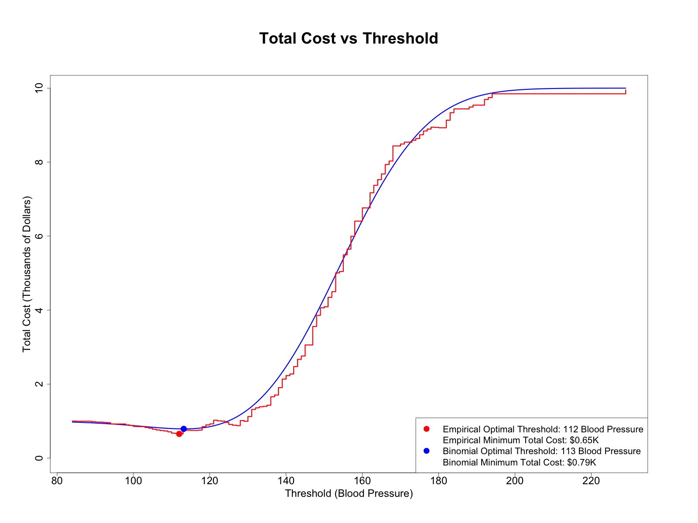
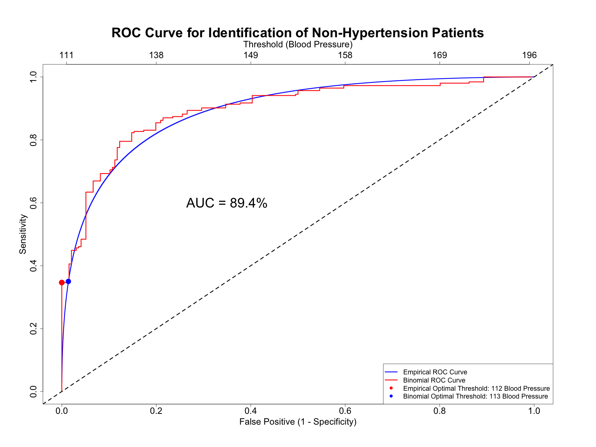

# Problem 1

## Instructions

(Problem 5.5 pg. 309) Let $X$ and $Y$ be two independent normally distributed random variables with means $\mu_X$ and $\mu_Y$ and variances $\sigma_X^2$ and $\sigma_Y^2$.

#### (a)

Prove that a necessary condition for $X \prec Y$ is that $\mu_X < \mu_Y$.

#### (b)

Provide an example when $\mu_X < \mu_Y$ but $X \not\prec Y$.

#### (c)

Prove that if $\sigma_X = \sigma_Y$, then $\mu_X < \mu_Y$ is a necessary and sufficient condition for $X \prec Y$.

## Solution

#### (a)

To prove that a necessary condition for $X \prec Y$ is that $\mu_X \le \mu_Y$, we'll first consider the definition of uniformly smaller. A random variable $X$ is said to be uniformly smaller than $Y$, denoted by $X \prec Y$, if for any $x$:

$$
Pr(X < x) > Pr(Y < x)
$$

Let $\Phi(x)$ denote the standard normal cdf. Since $X$ and $Y$ are normally distributed, we can express the above as:

$$
\Phi(\frac{x - \mu_X}{\sigma_X}) > \Phi(\frac{x - \mu_Y}{\sigma_Y})
$$

Let $z = \frac{x - \mu_X}{\sigma_X}$. Then, we have:

$$
\Phi(z) > \Phi(\frac{(\sigma_X z + \mu_X) - \mu_Y}{\sigma_Y}) = \Phi(\frac{\sigma_X}{\sigma_Y}z + \frac{\mu_X - \mu_Y}{\sigma_Y})
$$

Since $\Phi(x)$ is an increasing function and the inequality above must hold true $\forall z$ given that $X \prec Y$, we can see that the only way to satisfy this inequality is for $\frac{\sigma_X}{\sigma_Y} z + \frac{\mu_Y - \mu_X}{\sigma_Y} < z$. Because the standard deviations of $X$ and $Y$ are positive, this implies that:

$$
\mu_X - \mu_Y < 0 \Rightarrow \mu_X < \mu_Y
$$

#### (b)

In this example, let:

$$
X \sim \mathcal{N}(\mu_X = 0, \sigma_X^2 = 4)
$$

$$
Y \sim \mathcal{N}(\mu_Y = 1, \sigma_Y^2 = 1)
$$

In this example, $\mu_X < \mu_Y$, but let's check if $X \prec Y$:

$$
Pr(X < x) = \Phi(\frac{x - 0}{\sqrt{4}}) = \Phi(\frac{x}{2})
$$

$$
Pr(Y < x) = Phi(\frac{x - 1}{\sqrt{1}}) = \Phi(x - 1)
$$

Let $x = 6$. Then, we have:

$$
Pr(X < 6) = \Phi(3)
$$

$$
Pr(Y < 6) = \Phi(5)
$$

Because $\Phi(x)$ is an increasing function, we can see that:

$$
\Phi(3) < \Phi(5) \Rightarrow Pr(X < 6) < Pr(Y < 6) \Rightarrow X \not\prec Y
$$

And therefore, $X \not\prec Y$.

#### (c)

From part (a), we know that $X \prec Y$ is equivalent to:

$$
\Phi(z) > \Phi(\frac{\sigma_X}{\sigma_Y}z + \frac{\mu_X - \mu_Y}{\sigma_Y})
$$

If we let $\sigma_X = \sigma_Y$, then we have:

$$
\Phi(z) > \Phi(z + \frac{\mu_X - \mu_Y}{\sigma_Y})
$$

We know that $\sigma_Y$ is positive, so therefore if $\mu_X < \mu_Y$, then $\frac{\mu_X - \mu_Y}{\sigma_Y} < 0$, making the above inequality true $\forall z$, which implies that $X \prec Y$, making $\mu_X < \mu_Y$ a necessary and sufficient condition for $X \prec Y$ when $\sigma_X = \sigma_Y$.

# Problem 2

## Instructions

File `bp.csv` contains blood pressure (BP) for normal patients (controls, high=0) and hypertension patients (high=1).

#### (a)

Display two cdfs to demonstrate that BP among normal patients is uniformly smaller than among hypertension patients.

#### (b)

Display the data-driven ROC curve for the identification of normal patients and the superimposed binormal counterpart.

#### (c)

Compute and display AUCs using three methods: (1) empirical, as the sum or rectangles, (2) empirical, using vectorized computation, and (3) theoretical, using the formula.

#### (d)

The cost associated with overlooking a hypertension patient is \$10K and the cost of the false identification of hypertension is \$1K. Display the data-driven total cost and the superimposed continuous counterpart as a function of the threshold along with the respective optimal thresholds.

#### (e)

Display the optimal threshold on the binormal ROC curve and the respective BP scale using `axis(side=3)`.

## Solution

### Explanation

#### (a)

#### (b)

#### (c)

#### (d)

#### (e)

```bash
AUC calculated using sum of rectangles: 0.8968544
AUC calculated using vectorized computation: 0.8970754
AUC calculated using theoretical formula: 0.8936977
```

### Code

### Plots





