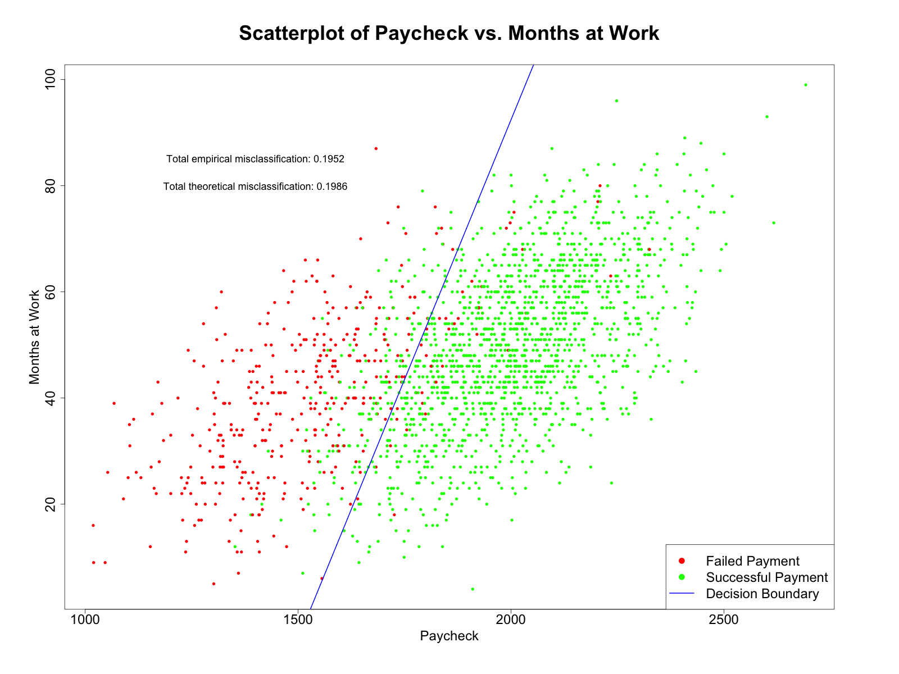

# Problem 1

## Instructions

A bank wants to develop a rule for granting or denying a credit card application. Over the years, the bank collected the data on $1996$ applicants - some of them failed a minimum payment and some did not, see the data `creditpr.csv`. The first column indicates `failed = 1`, `not failed = 0`; the second column contains monthly paycheck; and the third column contains months at work.

#### (a)

Develop and formulate the rule to grant credit card applications in the form $M < a + bP$, where $M$ is months at work and $P$ is paycheck.

#### (b)

Plot the data points using red for those who failed the minimum payment and green otherwise (use `legend`) and display the discrimination line.

#### (c)

Compute and display the total empirical and theoretical misclassification probability.

#### (d)

Compute the area under the respective binormal ROC curve and compare it with the total misclassification error from LDA. Hint: adopt the R function `mah`.

## Solution

### Written Solutions

#### (a)

If we assume that the populations of the two groups are normally distributed with equal covariance matrices, then the optimal rule is given by the linear discriminant rule. Let $\mathcal{N}(\boldsymbol{\mu}_x, \boldsymbol{\Omega})$ be the population for credit card non-payers, and $\mathcal{N}(\boldsymbol{\mu}_y, \boldsymbol{\Omega})$ be the population for credit card payers.

The linear discrimination rule is given by by finding a plane $(\bold{z} - \bold{s})^T\bold{n} = 0$ where $\bold{s}$ is called the translation vector and $\bold{n}$ is called the normal vector. A given point $\bold{z}$ is classified as $\bold{x}$ if $(\bold{z} - \bold{s})^T\bold{n} > 0$. The translation and normal vectors are given by:

$$
\bold{s} = \frac{1}{2}(\boldsymbol{\mu}_x + \boldsymbol{\mu}_y), \quad \bold{n} = \boldsymbol{\Omega}^{-1}(\boldsymbol{\mu}_x - \boldsymbol{\mu}_y)
$$

Now, we may computer our linear discrimination rule. Our populations of credit card non-payers and payers will both have mean values of paycheck ($P$), and months at work ($M$). We may then define their means as follows:

$$
\boldsymbol{\mu}_x = \begin{bmatrix} E[P_x] \\ E[M_x] \end{bmatrix}, \quad \boldsymbol{\mu}_y = \begin{bmatrix} E[P_y] \\ E[M_y] \end{bmatrix}
$$

We may also define the populations' covariance matrices as follows:

$$
\boldsymbol{\Omega} = \begin{bmatrix} \sigma^2_P & \sigma_{PM} \\ \sigma_{MP} & \sigma^2_M \end{bmatrix}
$$

We can then define the inverse of the covariance matrix using its adjoint and determinant:

$$
\boldsymbol{\Omega}^{-1} = \frac{1}{\sigma^2_P\sigma^2_M - \sigma^2_{PM}\sigma^2_{MP}} \begin{bmatrix} \sigma^2_M & -\sigma_{PM} \\ -\sigma_{MP} & \sigma^2_P \end{bmatrix}
$$

Substituting these values into our formulas for $\bold{s}$ and $\bold{n}$, we get:

$$
\bold{s} = \frac{1}{2} \begin{bmatrix} E[P_x] + E[P_y] \\ E[M_x] + E[M_y] \end{bmatrix} = \begin{bmatrix} s_1 \\ s_2 \end{bmatrix}, \quad \bold{n} = \boldsymbol{\Omega}^{-1} \begin{bmatrix} E[P_x] - E[P_y] \\ E[M_x] - E[M_y] \end{bmatrix} = \begin{bmatrix} n_1 \\ n_2 \end{bmatrix}
$$

So, our linear discriminant rule for classifying an applicant $\bold{z}$ with paycheck $P_z$ and months at work $M_z$ as group $\bold{x}$ (credit card non-payer) is:

$$
(\bold{z} - \bold{s})^T\bold{n} = \begin{bmatrix} P_z - s_1 \\ M_z - s_2 \end{bmatrix}^T \begin{bmatrix} n_1 \\ n_2 \end{bmatrix} > 0
$$

This expands to:

$$
n_1(P_z - s_1) + n_2(M_z - s_2) > 0 \Rightarrow n_1P_z + n_2M_z > n_1s_1 + n_2s_2
$$

$$
\Rightarrow M_z > \frac{n_1s_1 + n_2s_2}{n_2} - \frac{n_1}{n_2}P_z
$$

Define $a$ and $b$ as follows:

$$
a = \frac{n_1s_1 + n_2s_2}{n_2}, \quad b = -\frac{n_1}{n_2}
$$

Then, our linear discriminant rule for classifying an applicant $\bold{z}$ with months $M_z$ and paycheck $P_z$ as group $\bold{x}$ (credit card non-payer) is:

$$
M_z > a + bP_z
$$

Therefore, our linear discriminant rule for classifying an application $\bold{z}$ with months $M_z$ and paycheck $P_z$ as group $\bold{y}$ (credit card payer) and thus granting their application is:

$$
M_z < a + bP_z
$$

#### (d) Comparison of AUC and total misclassification.

We know that Total Misclassification ($T_M$) and the Area Under the Curve ($AUC$) are given by:

$$
T_M = 2 \Phi(\frac{-1}{2} \delta), \quad AUC = \Phi(\frac{\delta}{\sqrt{2}}) : \delta = \sqrt{(\bold{\mu}_x - \bold{\mu}_y)^T \boldsymbol{\Omega}^{-1} (\bold{\mu}_x - \bold{\mu}_y)}
$$

The equation for $AUC$ comes from pg. $301$ of the book.

$$
\Rightarrow \delta = \sqrt{2}\Phi^{-1}(AUC)
$$

$$
\Rightarrow T_M = 2 \Phi(\frac{-1}{\sqrt{2}} \Phi^{-1}(AUC))
$$

This equation implies that a larger $AUC$ will result in a smaller $T_M$. This makes sense, as a larger $AUC$ implies that the distributions of the two groups are more separated, and thus the probability of misclassification is lower.

### Code

```r
### Load data

data <- read.csv("./homeworks/hw7/data/creditpr.csv", header = T)

### Part B

## LDA Model

# Mean values of non-payers
mu_x <- colMeans(data[data$Failed == 1, c("Paycheck", "Months")])

# Mean values of payers
mu_y <- colMeans(data[data$Failed == 0, c("Paycheck", "Months")])

# num_payers
n_x <- sum(data$Failed == 0)

# num_nonpayers
n_y <- sum(data$Failed == 1)

# Covariance matrix
# Omega <- cov(data[, c("Paycheck", "Months")])
Omega <- (1 / (n_x + n_y - 2)) *
    ((n_x - 1) * cov(data[data$Failed == 0, c("Paycheck", "Months")]) +
        (n_y - 1) * cov(data[data$Failed == 1, c("Paycheck", "Months")]))

# Covariance matrix inverse
Omega_inv <- solve(Omega)

# Translation vector
s <- (mu_x + mu_y) / 2

# Normal vector
n <- Omega_inv %*% (mu_x - mu_y)

# Define slope and intercept
slope <- -n[1] / n[2]
intercept <- (n[1] * s[1] + n[2] * s[2]) / n[2]

### Part C

## Total empirical misclassification

# Number of misclassified payers
n_payers <- sum(
    (data$Failed == 0) & (data$Paycheck * slope + intercept < data$Months)
)

# Empirical misclassification rate of payers
payers_misclass <- n_payers / sum(data$Failed == 0)

cat("Empirical misclassification rate of payers:", payers_misclass, "\n")

# Number of misclassified non-payers
n_nonpayers <- sum(
    (data$Failed == 1) & (data$Paycheck * slope + intercept > data$Months)
)

# Empirical misclassification rate of non-payers
nonpayers_misclass <- n_nonpayers / sum(data$Failed == 1)

cat("Empirical misclassification rate of non-payers:", nonpayers_misclass, "\n")

# Total empirical misclassification
empirical_misclass <- payers_misclass + nonpayers_misclass

# Print total empirical misclassification
cat("Total empirical misclassification:", empirical_misclass, "\n")

## Total theoretical misclassification

# Compute delta
delta <- sqrt(t((mu_x - mu_y)) %*% Omega_inv %*% (mu_x - mu_y))

# Total theoretical misclassification
theoretical_misclass <- 2 * pnorm(delta / -2)

# Print total theoretical misclassification
cat("Total theoretical misclassification:", theoretical_misclass, "\n")

## Plotting

# Open a png device
png("./homeworks/hw7/plots/q1b.png", width = 1600, height = 1200)

# Set margins
par(mar = c(8, 8, 8, 8))

# Make scatterplot
plot(
    data$Paycheck,
    data$Months,
    col = ifelse(data$Failed == 1, "red", "green"),
    pch = 16,
    xlab = "Paycheck",
    ylab = "Months at Work",
    main = "Scatterplot of Paycheck vs. Months at Work",
    cex.main = 3,
    cex.lab = 2,
    cex.axis = 2
)

# Add decision boundary (z - s)^T %*% n = 0

# Generate a sequence of x values to use for the decision boundary
x_values <- seq(min(data$Paycheck), max(data$Paycheck), by = 0.1)

# Compute the corresponding y values for the decision boundary
y_values <- slope * x_values + intercept

# Add the decision boundary to the plot
lines(
    x_values,
    y_values,
    col = "blue",
    lwd = 2
)

# Add text in the center displaying the total empirical misclassification
text(
    x = 1400,
    y = 85,
    paste(
        "Total empirical misclassification:",
        round(empirical_misclass, 4)
    ),
    cex = 1.5
)

# Add text in the center displaying the total theoretical misclassification
text(
    x = 1400,
    y = 80,
    paste(
        "Total theoretical misclassification:",
        round(theoretical_misclass, 4)
    ),
    cex = 1.5
)

# Add legend
legend(
    "bottomright",
    legend = c("Failed Payment", "Successful Payment", "Decision Boundary"),
    col = c("red", "green", "blue"),
    pch = c(16, 16, NA),
    lty = c(NA, NA, 1),
    lwd = c(NA, NA, 2),
    cex = 2
)

# Close the png device
dev.off()

### Part D

# Computer the theoretical AUC
AUC <- pnorm(delta / sqrt(2))

cat("Theoretical/Binomial AUC:", AUC, "\n")

# Define paycheck thresholds
paycheck_limits <- range(data$Paycheck)
thresholds <- seq(paycheck_limits[1], paycheck_limits[2], length.out = 100)

## Get the binomial CDF's of payers and non-payers

# Payers:
x_cdf <- pnorm((thresholds - mu_x[1]) / sqrt(Omega[1, 1]))
y_cdf <- pnorm((thresholds - mu_y[1]) / sqrt(Omega[1, 1]))

## Plotting

# Open a png device
png("./homeworks/hw7/plots/q1d.png", width = 1600, height = 1200)

# Set margins
par(mar = c(8, 8, 8, 8))

# Plot the binomial ROC curve (cdf_y vs cdf_x)
plot(
    x_cdf,
    y_cdf,
    type = "l",
    col = "blue",
    lwd = 2,
    xlab = "Payers CDF (1 - Specificity)",
    ylab = "Non-Payers CDF (Sensitivity)",
    main = "Binomial ROC Curve For Identification of Non-Payers",
    cex.main = 3,
    cex.lab = 2,
    cex.axis = 2
)

# Add the diagonal line
lines(
    c(0, 1),
    c(0, 1),
    col = "black",
    lwd = 2,
    lty = 2
)

# Add text in middle of plot to display AUC %
text(
    x = 0.35,
    y = 0.6,
    labels = paste("AUC = ", round(AUC, 3) * 100, "%", sep = ""),
    cex = 3
)

# Add legend
legend(
    "bottomright",
    legend = c("ROC Curve", "45 Degree Line"),
    col = c("blue", "black"),
    lwd = c(2, 2),
    lty = c(1, 2),
    cex = 2
)

# Close the png device
dev.off()
```

### Plots




# Problem 2

## Instructions

Logistic regression has two predictors $x_1$ and $x_2$. Develop algorithms for testing the null hypothesis that the two slope coefficients are the same via the Wald and likelihood ratio test. Formulate algorithms as step-by-step computations with the rule for accepting or rejecting the null hypothesis.

## Solution

Let us first define our null and alternative hypothesis:

$$
H_0: \beta_1 = \beta_2, \quad H_a: \beta_1 \neq \beta_2
$$

Where $\beta_1$ and $\beta_2$ are the slope coefficients for $x_1$ and $x_2$, respectively. We may define the coefficients of our model as follows:

$$
\boldsymbol{\beta} = \begin{bmatrix} \beta_0 \\ \beta_1 \\ \beta_2 \end{bmatrix}
$$

Where $\beta_0$ is the intercept coefficient.

### Wald Algorithm

1. Let $\hat{\beta}_{1_{MLE}}$ and $\hat{\beta}_{2_{MLE}}$ be our maximum likelihood estimators for $\beta_1$ and $\beta_2$. Combine the two estimators into a linear combination of the form $\tilde{\beta} = \hat{\beta}_{1_{MLE}} - \hat{\beta}_{2_{MLE}}$. Under our null hypothesis, $\tilde{\beta} = 0$.

2. Note that each estimator $\hat{\beta}_{i_{MLE}}$ is distributed as follows:

$$
\hat{\beta}_{i_{MLE}} \sim \mathcal{N}(\beta_i, var(\hat{\beta}_{i_{MLE}}))
$$

$\quad \quad$ Therefore, under our null hypothesis, the linear combination $\tilde{\beta}$ is thus distributed as follows:

$$
\tilde{\beta} \sim \mathcal{N}(\beta_1 - \beta_2, var(\hat{\beta}_{1_{MLE}} + \hat{\beta}_{2_{MLE}})) \sim \mathcal{N}(0, var(\hat{\beta}_{1_{MLE}}) + var(\hat{\beta}_{2_{MLE}}) - 2cov(\hat{\beta}_{1_{MLE}}, \hat{\beta}_{2_{MLE}}))
$$

3. Calculate the fisher information matrix:

$$
\bold{I}(\boldsymbol{\beta}) = \bold{X}^T\bold{D}\bold{X}
$$

$$
\bold{X} = \begin{bmatrix} \bold{1} && \bold{x}_1 && \bold{x}_2 \end{bmatrix}, \quad \bold{D} = \begin{bmatrix} \frac{e^{\boldsymbol{\beta}^T \bold{X}_0}}{(1 + (e^{\boldsymbol{\beta}^T \bold{X}_0})^2)} && 0 && 0 && 0 \\ 0 && \frac{e^{\boldsymbol{\beta}^T \bold{X}_1}}{(1 + (e^{\boldsymbol{\beta}^T \bold{X}_1})^2)} && 0 && 0 \\ 0 && 0 && \ddots && 0 \\ 0 && 0 && 0 && \frac{e^{\boldsymbol{\beta}^T \bold{X}_n}}{(1 + (e^{\boldsymbol{\beta}^T \bold{X}_n})^2)} \end{bmatrix}
$$

4. We are now able to compute the covariance matrix of $\boldsymbol{\beta}$ as the inverse of the fisher information matrix, and can thus derive values for $var(\hat{\beta}_{1_{MLE}})$, $var(\hat{\beta}_{2_{MLE}})$, and $cov(\hat{\beta}_{1_{MLE}}, \hat{\beta}_{2_{MLE}})$:

$$
var(\hat{\beta}_{1_{MLE}}) = \bold{I}^{-1}_{11}(\boldsymbol{\beta}), \quad var(\hat{\beta}_{2_{MLE}}) = \bold{I}^{-1}_{22}(\boldsymbol{\beta}), \quad cov(\hat{\beta}_{1_{MLE}}, \hat{\beta}_{2_{MLE}}) = \bold{I}^{-1}_{12}(\boldsymbol{\beta}) = \bold{I}^{-1}_{21}(\boldsymbol{\beta})
$$

$\quad \quad$ Where $\bold{I}^{-1}_{ij}(\boldsymbol{\beta})$ is the $(i, j)$th element of the inverse of the fisher information matrix (using zero-based indexing).

5. Define the Z-score for $\tilde{\beta}$:

$$
Z = \frac{\tilde{\beta} - 0}{\sqrt{var(\tilde{\beta})}} = \frac{\tilde{\beta}}{\sqrt{var(\hat{\beta}_{1_{MLE}}) + var(\hat{\beta}_{2_{MLE}}) - 2cov(\hat{\beta}_{1_{MLE}}, \hat{\beta}_{2_{MLE}})}} = \frac{\tilde{\beta}}{I^{-1}_{11}(\boldsymbol{\beta}) + I^{-1}_{22}(\boldsymbol{\beta}) + 2I^{-1}_{12}(\boldsymbol{\beta})} \sim \mathcal{N}(0, 1)
$$

6. Given we are using an $\alpha$ significance level, we can reject the null hypothesis if $|Z| > Z_{1 - \alpha/2}$, where $Z_{1 - \alpha/2}$ is the $1 - \alpha/2$ quantile of the standard normal distribution.

### Likelihood Ratio Algorithm

1. Define our likelihood ratio test statistic as $A \boldsymbol{\beta}$ such that:

$$
\bold{A} = \begin{bmatrix} 0 && 1 && -1 \end{bmatrix}
$$

2. Identify that our null hypothesis implies that:

$$
A \boldsymbol{\beta} = 0
$$

3. Define our likelihood ratio test statistic as follows:

$$
-2[\max\limits_{\bold{A} \boldsymbol{\beta} = 0}l(\boldsymbol{\beta}) - l(\hat{\boldsymbol{\beta}}_{MLE})] \simeq \chi^2(1)
$$

4. Find the constrained and unconstrained maximum likelihood estimator of $\boldsymbol{\beta}$. Keep in mind that log likelihood function is defined at $l(\boldsymbol{\beta}) = \sum_{i = 1}^n (y_i \boldsymbol{\beta}^T \bold{x}_i - ln(1 + e^{\boldsymbol{\beta}^T \bold{x}_i}))$ where $y_i$ represents the binary outcome.

$$
\max\limits_{\bold{A} \boldsymbol{\beta} = 0} l(\boldsymbol{\beta}) = \sum_{i = 1}^n (y_i \beta_0 + y_i \beta_1 (x_{i1} + x_{i2}) - \ln(1 + e^{\beta_0 + \beta_1 (x_{i1} + x_{i2})}))
$$

$$
l(\hat{\boldsymbol{\beta}}_{MLE}) = \sum_{i = 1}^n (y_i \beta_0 + y_i \beta_1 x_{i1} + y_i \beta_2 x_{i2} - \ln(1 + e^{\beta_0 + y_i \beta_1 x_{i1} + y_i \beta_2 x_{i2}}))
$$

$$
\Rightarrow -2(ln(\frac{l(\max\limits_{\bold{A} \boldsymbol{\beta} = 0})}{l(\hat{\boldsymbol{\beta}}_{MLE})})) \simeq \chi^2(1)
$$

5. Compute the p-value as follows. Let $F(x)$ be the cumulative distribution function of the $\chi^2(1)$ distribution.

$$
p = 1 - F(-2(ln(\frac{l(\max\limits_{\bold{A} \boldsymbol{\beta} = 0})}{l(\hat{\boldsymbol{\beta}}_{MLE})})))
$$

6. Given we are using a $\alpha$ significance level, we can reject the null hypothesis if $p < \alpha$. We use a one-sided test because we are only interested in the case where the likelihood ratio test statistic is greater than the critical value.
