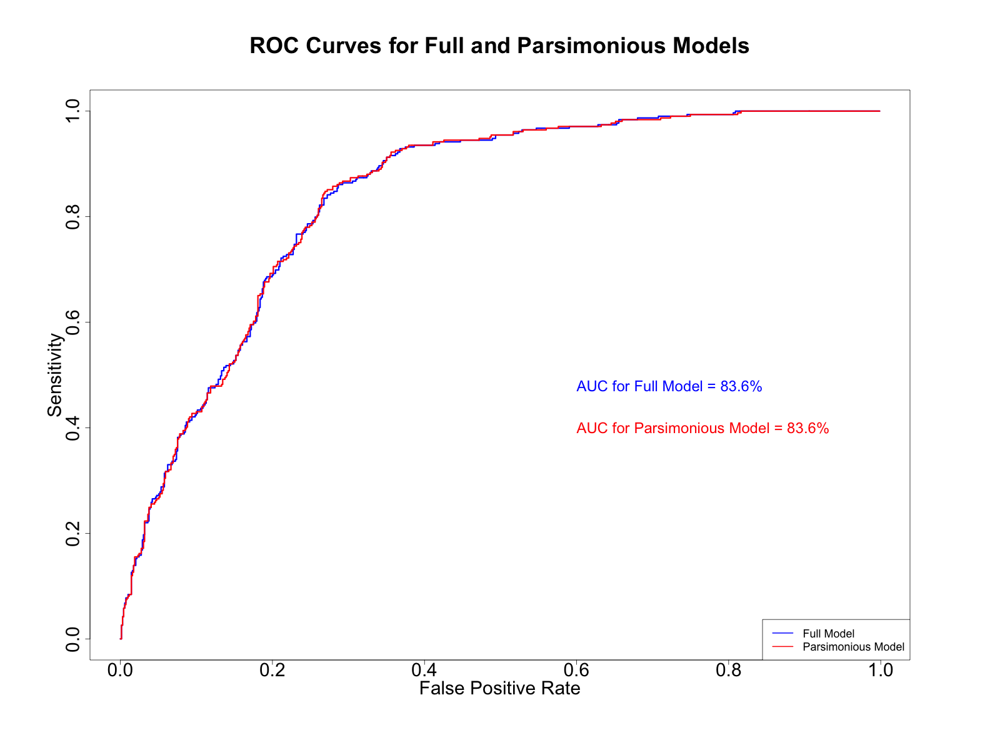

# Problem 1

## Instructions

The file `amazshop.csv` contains the following information on $1000$ Amazon.com shoppers: `shop=1` indicates the internal definition of active shoppers and `0` otherwise, `age`, `sex=1` codes male and `0` female, `total` contains the dollar amount spent during the year, and `npurch` indicates the number of items sold.

#### (a)

Run logistic regression on the four variables and develop a parsimonious model by selecting only statistically significant variables.

#### (b)

Test the hypothesis on the validity of the logistic regression using the likelihood ratio test by testing that all slope coefficients are zero.

#### (c)

Plot the probability to be qualified as an active shopper versus total amount for the shopper of age $20$ and age $60$.

#### (d)

Compute and display the $95\%$ confidence interval for the probability of a person who spends $\$2000$ per year and is $60$ years old.

#### (e)

Compute and display the ROC curves along with AUCs for identification of an inactive shopper for full and parsimonious model using different color.

## Solution

#### (a)

First, I loaded the data from the `amazshop.csv` file. Then, I fit a full logistic regression model to the data, using the `glm()` function in R with `family = binomial`, including all four predictors: `age`, `sex`, `total` and `npurch`. After running the full model, I examined the summary of the model to check the significance of each predictor. I found that only the variables age and total were significant, so I created a new, parsimonious model, which only includes these two variables.

#### (b)

I started by creating a null model, which does not include any predictors and only contains an intercept. Then, I performed a likelihood ratio test to compare the null model with the parsimonious model. This test assesses the hypothesis that all the slope coefficients are zero in the parsimonious model. The p-value I obtained was extremely low (`1.896326e-65`), suggesting strong evidence against the null hypothesis. This p-value indicates that we may reject the null hypothesis that all the slope coefficients are zero.

#### (c)

In this step, I created two data frames, one for shoppers of age $20$ and another for shoppers of age $60$, each with a sequence of total spent values. After sorting the data frames by total spent, I used the `predict()` function to compute the probability of being an active shopper for each total spent value using the parsimonious model. I added these predicted probabilities as a new prob column in each data frame.

#### (d)

I first defined an age of $60$ and a total spent amount of $\$2000$. Then, I extracted the coefficients from the parsimonious model and used these coefficients along with the defined age and total values to calculate the linear predictor on the logit scale for these values as well as for all data in the dataset. I transformed these linear predictors to the probability scale and computed `d_i` for all data.

Next, I calculated the covariance matrix and inverted it. Using the inverted covariance matrix along with the age and total values, I computed the variance of the probability. Using this variance, I calculated the lower and upper bounds of the confidence interval on the linear scale and transformed these bounds back to the probability scale. The result was the $95\%$ confidence interval for the probability that a person who spends $\$2000$ per year and is $60$ years old is an active shopper. The confidence interval was $(0.7276717, 0.8359433)$.

#### (e)

I computed the ROC curves and the AUC values for both the full model and the parsimonious model. These measures provide a way to evaluate the overall performance of a binary classification model. I calculated the sensitivity (true positive rate) and false positive rate for all possible thresholds and plotted these values to create the ROC curves. The AUC was then computed by summing up the areas of the trapezoids formed by consecutive points on the ROC curve.

Finally, I plotted the ROC curves for both models on the same graph, using different colors for easy comparison. The AUC values were also displayed on the graph. The code block ends with the creation of two png files, one illustrating the probability of being an active shopper versus the total spent for shoppers of age 20 and 60, and the other showing the ROC curves for the full and parsimonious models.

### Code

```r
### Load data

shopper_data <- read.csv("./homeworks/hw8/data/amazshop.csv", header = T)

### Part A

# Create logistic regression model

full_model <- glm(
    shop ~ .,
    data = shopper_data, family = binomial
)

# summary(model)

# Create logistic regression model with only significant variables
parsimonious_model <- glm(
    shop ~ age + total,
    data = shopper_data, family = binomial
)

# summary(parsimonious_model)

### Part B

# Create the model under null hypothesis

null_model <- glm(
    shop ~ 1,
    data = shopper_data, family = binomial
)

## Calculating the likelihood ratio test

# Compute the likelihoods of the null model and the parsimonious model
null_deviance <- null_model$deviance
parsimonious_deviance <- parsimonious_model$deviance

# The likelihood ratio statistic (deviance) is the difference in deviance
# between the null model and the full model.
lr_stat <- null_deviance - parsimonious_deviance

# The degrees of freedom is the difference in degrees of freedom between
# the null model and the parsimonious model.
df <- null_model$df.residual - parsimonious_model$df.residual

# Use the chi-squared distribution to compute the p-value
p_value <- pchisq(lr_stat, df, lower.tail = FALSE)

# Print the p-value
print(p_value)

### Part C

# Define a sequence from minimum total to maximum total
total_seq <- seq(min(shopper_data$total),
    max(shopper_data$total),
    length.out = 10000
)

# Create data frames for 20 and 60 year old shoppers
shopper_data_20 <- data.frame(total = total_seq, age = 20)
shopper_data_60 <- data.frame(total = total_seq, age = 60)

# Make sure the data frames are sorted by total
shopper_data_20 <- shopper_data_20[order(shopper_data_20$total), ]
shopper_data_60 <- shopper_data_60[order(shopper_data_60$total), ]

# Predict the probability of shopping for 20 and 60 year olds
shopper_data_20$prob <- predict(
    parsimonious_model, shopper_data_20,
    type = "response"
)
shopper_data_60$prob <- predict(
    parsimonious_model, shopper_data_60,
    type = "response"
)

### Part D

# Define age and total spent
age_value <- 60
total_value <- 2000

# Get the coefficients of the logistic regression model
model_coefficients <- coef(parsimonious_model)

# Linear predictor for the given age and total
linear_predictor <- model_coefficients[1] + model_coefficients[2] *
    age_value + model_coefficients[3] * total_value

# Linear predictor for all data
linear_predictor_all <- model_coefficients[1] + model_coefficients[2] *
    shopper_data$age + model_coefficients[3] * shopper_data$total

# Exponential of the linear predictors
exp_linear_predictor_all <- exp(linear_predictor_all)

# Compute di for all data, which is used to compute the covariance matrix
d_i <- exp_linear_predictor_all / (1 + exp_linear_predictor_all)^2

# Compute the covariance matrix
cov_matrix <- matrix(0, 3, 3)
cov_matrix[1, 1] <- sum(d_i)
cov_matrix[1, 2] <- sum(d_i * shopper_data$age)
cov_matrix[1, 3] <- sum(d_i * shopper_data$total)
cov_matrix[2, 1] <- cov_matrix[1, 2]
cov_matrix[2, 2] <- sum(d_i * shopper_data$age^2)
cov_matrix[2, 3] <- sum(d_i * shopper_data$age * shopper_data$total)
cov_matrix[3, 1] <- cov_matrix[1, 3]
cov_matrix[3, 2] <- cov_matrix[2, 3]
cov_matrix[3, 3] <- sum(d_i * shopper_data$total^2)

# Invert the covariance matrix
cov_matrix <- solve(cov_matrix)

# Instantiate an x vector
x <- c(1, age_value, total_value)

# Compute variance of the probability
var_prob <- t(x) %*% cov_matrix %*% x

# Compute the z-score for the alpha level
alpha <- 0.05
z_score <- qnorm(1 - alpha / 2)

# Compute the lower and upper bounds of the confidence interval
lower_bound <- linear_predictor - z_score * sqrt(var_prob)
upper_bound <- linear_predictor + z_score * sqrt(var_prob)

# Transform back to the probability scale
lower_bound_prob <- exp(lower_bound) / (1 + exp(lower_bound))
upper_bound_prob <- exp(upper_bound) / (1 + exp(upper_bound))

confidence_interval <- c(lower_bound_prob, upper_bound_prob)

# Print the confidence interval
print(confidence_interval)

## Plotting

# Open a png device
png("./homeworks/hw8/plots/q1c.png", width = 1600, height = 1200)

# Set the margins
par(mar = c(10, 10, 10, 10))

# Plot the probability of shopping for 20 year olds vs. total
plot(
    shopper_data_20$total, shopper_data_20$prob,
    type = "l", col = "blue", lwd = 3,
    xlab = "Total Spent ($)", ylab = "Probability of Being an Active Shopper",
    main = "Probability of Being an Active Shopper vs. Total Spent",
    cex.main = 3, cex.lab = 2.5, cex.axis = 2.5
)

# Plot the probability of shopping for 60 year olds vs. total
lines(
    shopper_data_60$total, shopper_data_60$prob,
    type = "l", col = "red", lwd = 3
)

# Add a point for 60 year old who spends $2000
points(
    total_value, predict(
        parsimonious_model, data.frame(age = age_value, total = total_value),
        type = "response"
    ),
    col = "red", pch = 19, cex = 2
)

# Add a like for the confidence interval
lines(
    c(total_value, total_value),
    c(confidence_interval[1], confidence_interval[2]),
    col = "red", lwd = 3
)

# Add a legend
legend(
    "bottomright",
    legend = c("20 Years Old", "60 Years Old", "60 Years Old, $2000 Spent"),
    col = c("blue", "red", "red"),
    lty = c(1, 1, 0), pch = c(NA, NA, 19),
    lwd = 2, cex = 2
)

# Close the png device
dev.off()

### Part E

# Full Model

# Coefficients of the full model
full_model_coefficients <- coef(full_model)

# Independent variables matrix for the full model
X_full <- as.matrix(shopper_data[, names(full_model_coefficients)[-1]])

# Linear predictors for the full model
full_model_linpred <- full_model_coefficients[1] +
    X_full %*% full_model_coefficients[-1]

# Active shopper indicator
Y <- shopper_data$shop

# Sensitivity and False positive rates for full model
n <- nrow(shopper_data)
sensitivity_full <- false_positive_full <- numeric(n)
AUC_full <- 0
sorted_full_model_linpred <- sort(full_model_linpred)

for (i in 1:n) {
    sensitivity_full[i] <- sum(full_model_linpred >
        sorted_full_model_linpred[i] & Y == 1) / sum(Y == 1)
    false_positive_full[i] <- sum(full_model_linpred >
        sorted_full_model_linpred[i] & Y == 0) / sum(Y == 0)
    if (i > 1) {
        AUC_full <- AUC_full + sensitivity_full[i] *
            (false_positive_full[i - 1] - false_positive_full[i])
    }
}

# Parsimonious Model

# Coefficients of the parsimonious model
pars_model_coefficients <- coef(parsimonious_model)

# Independent variables matrix for the parsimonious model
X_pars <- as.matrix(shopper_data[, names(pars_model_coefficients)[-1]])

# Linear predictors for the parsimonious model
pars_model_linpred <- pars_model_coefficients[1] +
    X_pars %*% pars_model_coefficients[-1]

# Sensitivity and False positive rates for parsimonious model
sensitivity_pars <- false_positive_pars <- numeric(n)
AUC_pars <- 0
sorted_pars_model_linpred <- sort(pars_model_linpred)

for (i in 1:n) {
    sensitivity_pars[i] <- sum(pars_model_linpred >
        sorted_pars_model_linpred[i] & Y == 1) / sum(Y == 1)
    false_positive_pars[i] <- sum(pars_model_linpred >
        sorted_pars_model_linpred[i] & Y == 0) / sum(Y == 0)
    if (i > 1) {
        AUC_pars <- AUC_pars + sensitivity_pars[i] *
            (false_positive_pars[i - 1] - false_positive_pars[i])
    }
}

# Plotting ROC curves

# Open a png device
png("./homeworks/hw8/plots/q1e.png", width = 1600, height = 1200)

# Set the margins
par(mar = c(10, 10, 10, 10))

# Plot ROC curve for the full model
plot(false_positive_full, sensitivity_full,
    type = "s", lwd = 3,
    xlab = "False Positive Rate", ylab = "Sensitivity",
    main = "ROC Curves for Full and Parsimonious Models", col = "blue",
    cex.main = 3, cex.lab = 2.5, cex.axis = 2.5
)

# Add AUC for full model
text(
    0.6, 0.48, paste("AUC for Full Model = ",
        round(AUC_full * 100, 1), "%",
        sep = ""
    ),
    adj = 0, cex = 2, col = "blue"
)

# Add ROC curve for the parsimonious model
lines(false_positive_pars, sensitivity_pars, type = "s", lwd = 3, col = "red")

# Add AUC for parsimonious model
text(
    0.6, 0.4, paste("AUC for Parsimonious Model = ",
        round(AUC_pars * 100, 1), "%",
        sep = ""
    ),
    adj = 0, cex = 2, col = "red"
)

# Add a legend
legend("bottomright", c("Full Model", "Parsimonious Model"),
    col = c("blue", "red"),
    lty = 1, lwd = 2, cex = 1.5
)

# Close the png device
dev.off()
```




# Problem 2

## Instructions

#### (a)

Apply PCA to project the iris data onto the plane, display and color each flower.

#### (b)

Compute and display on each axis the proportion of variance explained and two components together on the top of the graph. Use `legend` for flower colors.

#### (c)

Display the proportion of variance explained by PCA projections as in `swiss(job=3)`.

## Solution

#### (a)

First, I processed the iris dataset using Principal Component Analysis (PCA). I extracted the four features of the dataset and used these to create a covariance matrix. By calculating the eigenvalues and eigenvectors of this matrix, I determined the two most significant dimensions. This allowed me to project the multi-dimensional iris data onto a 2D plane for visualization. The points were colored according to the species of each iris flower, providing a visual representation of the data separation achieved through PCA.

#### (b)

Next, I evaluated the effectiveness of the PCA transformation. This was done by calculating the proportion of variance in the dataset that was captured by the first and second principal components. I then displayed these proportions on the respective axes of the plotted graph. The total variance explained by the first two components was also calculated and displayed at the top of the graph. To aid interpretation, a legend for the flower colors was added to the plot.

#### (c)

Lastly, I wanted to visualize the cumulative variance explained by the PCA components. To do this, I calculated the variance explained by each component and used it to create a line graph. This graph showed the proportion of cumulative variance explained as more components were considered. It allowed for an understanding of the trade-off between the number of components and the proportion of variance explained, essentially visualizing the efficiency of the PCA transformation.

### Code

```r
# Access the iris dataset
data <- iris

### Part A

# Define features
X <- data[, 1:4]

# Define labels
Y <- data[, 5]

# Define a covariance matrix of the features
W <- cov(X)

# Get the eigenvalues and eigenvectors of the covariance matrix
eigen <- eigen(W, symmetric = TRUE)

# Get the two eigenvectors with the largest eigenvalues
p <- eigen$vectors[, 1:2]

# Split the eigenvectors into two vectors
p1 <- p[, 1]
p2 <- p[, 2]

# Center the data
Z <- scale(X, center = TRUE, scale = FALSE)

# Project the data onto the plane spanned by the two eigenvectors
proj <- Z %*% p

### Part B

# Get the two maximum eigenvalues
lambda <- eigen$values[1:2]

# Compute total variance as the sum of the eigenvalues
total_variance <- sum(eigen$values)

# Compute the variance explained by the first PCA component
variance_explained_1 <- lambda[1] / total_variance

# Compute the variance explained by the second PCA component
variance_explained_2 <- lambda[2] / total_variance

# Compute total variance explained by the first two PCA components
total_variance_explained <- variance_explained_1 + variance_explained_2

## Plotting

# Open a png device
png("./homeworks/hw8/plots/q2b.png", width = 1600, height = 1200)

# Set the margins
par(mar = c(10, 10, 10, 10))

# Set the x and y labels
xlabel <- paste(
    "1st PCA Component Explains ",
    round(variance_explained_1 * 100, 2), "% of the Variance",
    sep = ""
)
ylabel <- paste(
    "2nd PCA Component Explains ",
    round(variance_explained_2 * 100, 2), "% of the Variance",
    sep = ""
)

# Set the main text
main_text <- paste(
    "PCA Projection of Iris Dataset Onto Plane \n Total Variance Explained: ",
    round(total_variance_explained * 100, 2), "%",
    sep = ""
)

# Plot the projection
plot(
    proj,
    xlab = "", ylab = "", main = main_text,
    cex.main = 3, cex.axis = 2
)

# Add the x and y labels
axis(1, at = 0, labels = xlabel, cex.axis = 2, line = 4)
axis(2, at = 0, labels = ylabel, cex.axis = 2, line = 4)

# Plot the iris flowers with different colors
points(proj[Y == "setosa", ], col = "red", pch = 16, cex = 2)
points(proj[Y == "versicolor", ], col = "green", pch = 16, cex = 2)
points(proj[Y == "virginica", ], col = "blue", pch = 16, cex = 2)

# Add a legend
legend(
    "bottomright",
    legend = c("setosa", "versicolor", "virginica"),
    col = c("red", "green", "blue"),
    pch = 16,
    cex = 2
)

# Close the png device
dev.off()

### Part C

# Define all lambdas
lambdas <- eigen$values

# Define an array for variance explained by each component
variance_explained <- rep(0, length(lambdas))

# Define number of components
num_components <- length(lambdas)

# Compute the variance explained by each component
for (i in 1:num_components) {
    variance_explained_component <- lambdas[i] / total_variance
    if (i == 1) {
        variance_explained[i] <- variance_explained_component
    } else {
        variance_explained[i] <- variance_explained[i - 1] +
            variance_explained_component
    }
}

# Add a zero to the beginning of the variance explained array
variance_explained <- c(0, variance_explained)

## Plotting

# Open a png device
png("./homeworks/hw8/plots/q2c.png", width = 1600, height = 1200)

# Set the margins
par(mar = c(10, 10, 10, 10))

# Set the main text
main_text <- "Proportion of Cumulative Variance Explained by each PCA Component"

# Plot the variance explained by each component
plot(
    x = c(0, 1, 2, 3, 4), y = variance_explained, type = "l",
    xlab = "", ylab = "",
    main = main_text, xlim = c(0, num_components), ylim = c(0, 1),
    cex.main = 3, cex.axis = 2, cex.lab = 2, lwd = 3
)

# Set the x and y labels
xlabel <- "Number of PCA Components"
ylabel <- "Variance Explained"

# Add points
points(x = c(1, 2, 3, 4), y = variance_explained[2:5], pch = 16, cex = 2)

# Label the x and y axes
axis(1, at = 2, labels = xlabel, cex.axis = 2, line = 5)
axis(2, at = .5, labels = ylabel, cex.axis = 2, line = 5)

# Close the png device
dev.off()
```


