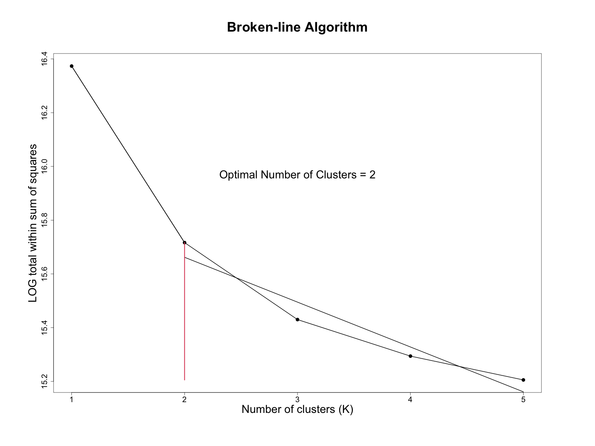

# Problem 1

## Instructions

Apply the K-means algorithm to Goldman.imputed.csv data set.

#### (a)

Use the broken-line algorithm to identify the number of clusters.

#### (b)

Does clustering reflect gender? To address this question, plot "gender" as 0/1 on the x-axis for individuals 1-1528 and use red/green to color males and females. Save the graphics in the png format with large number of pixels.

#### (c)

Upon viewing the graph upon magnification, do you think that clustering reflects gender? Hint: Use axes=F and make your own axis(side=1).

#### (d)

Compute % females in cluster 1 and cluster 2. Does your answer match visual inspection? Display the number of females in the title.

## Solutions

#### (a)

The broken-line algorithm returns an optimal number of clusters of 2, when I used `Kmax` up to 6. If I set `Kmax` at 7 or higher, the algorithm returns an optimal number of clusters of 3, but this is likely too high of a `Kmax`.

Below is the plot of the broken-line algorithm.

#### (b)

Yes, clustering does reflect gender. Cluster $1$ has almost all of the female (green) individuals.

#### (c)

Zooming in still shows that almost all of the female individuals are in cluster $1$.

#### (d)

Cluster $1$ has $82\%$ of the females in it, and cluster $2$ has $18\%$ of the females in it. This suggests that two clusters follow the gender separation of the individuals, and supports my previous statements that the clusters reflect gender. 

Below are the full and zoomed in plots of the cluster assignment of each individual.

