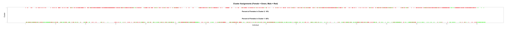

# Problem 1

## Instructions

Apply the K-means algorithm to Goldman.imputed.csv data set.

#### (a)

Use the broken-line algorithm to identify the number of clusters.

#### (b)

Does clustering reflect gender? To address this question, plot "gender" as 0/1 on the x-axis for individuals 1-1528 and use red/green to color males and females. Save the graphics in the png format with large number of pixels.

#### (c)

Upon viewing the graph upon magnification, do you think that clustering reflects gender? Hint: Use axes=F and make your own axis(side=1).

#### (d)

Compute % females in cluster 1 and cluster 2. Does your answer match visual inspection? Display the number of females in the title.

## Solutions

#### (a)

The broken-line algorithm returns an optimal number of clusters of 2, when I used `Kmax` up to 6. If I set `Kmax` at 7 or higher, the algorithm returns an optimal number of clusters of 3, but this is likely too high of a `Kmax`.

Below is the plot of the broken-line algorithm.


#### (b)

Yes, clustering does reflect gender. Cluster $1$ has almost all of the female (green) individuals.

#### (c)

Zooming in still shows that almost all of the female individuals are in cluster $1$.

#### (d)

Cluster $1$ has $82\%$ of the females in it, and cluster $2$ has $18\%$ of the females in it. This suggests that two clusters follow the gender separation of the individuals, and supports my previous statements that the clusters reflect gender.

Below are the full and zoomed in plots of the cluster assignment of each individual.




### Code

```r
### Load data

goldman_data <- read.csv("./homeworks/hw9/data/Goldman.imputed.csv", header = T)

### Part A

# Define the maximum number of clusters to consider
Kmax <- 5

# Pre-allocate vector for total within-cluster sum of squares (TWSS)
TWSS <- rep(NA, Kmax)

# Calculate TWSS for different number of clusters (from 1 to Kmax)
for (i in 1:Kmax) {
    TWSS[i] <- kmeans(goldman_data, centers = i, nstart = 10)$tot.withinss
}

# Log-transform the TWSS
LTWSS <- log(TWSS)

## Implement the broken-line algorithm

# Initialize minimum two residual sum of squares
TwoRSS_MIN <- Inf

for (ik in 2:(Kmax - 2)) {
    x1 <- 1:ik
    y1 <- LTWSS[x1]
    x2 <- ik:Kmax
    y2 <- LTWSS[x2]

    # Calculate two residual sum of squares
    TwoRSS <- sum(lm(y1 ~ x1)$residuals^2) +
        sum(lm(y2 ~ x2)$residuals^2)

    if (TwoRSS < TwoRSS_MIN) {
        TwoRSS_MIN <- TwoRSS
        # Save the number of clusters corresponding to the minimum TwoRSS
        optimal_K <- ik
    }
}

# Print the optimal number of clusters
print(paste("Optimal number of clusters =", optimal_K))

## Plotting

# Open a PNG device
png("./homeworks/hw9/plots/q1a.png", width = 1600, height = 1200)

# Set the margins
par(mar = c(10, 10, 10, 10))

# Plot the LTWSS for visual inspection
plot(
    1:Kmax, LTWSS,
    type = "o", lwd = 2,
    main = "Broken-line Algorithm",
    xlab = "Number of clusters (K)", ylab = "LOG total within sum of squares",
    cex.lab = 2.5, cex.axis = 1.75, cex.main = 3, cex.sub = 2,
    pch = 19, cex = 1.5,
)

# Draw two-segment lines on the plot
x1 <- 1:optimal_K
y1 <- LTWSS[x1]
x2 <- optimal_K:Kmax
y2 <- LTWSS[x2]
y1 <- lm(y1 ~ x1)$fitted.values
lines(x1, y1, lwd = 2)
y2 <- lm(y2 ~ x2)$fitted.values
lines(x2, y2, lwd = 2)
segments(optimal_K, min(LTWSS), optimal_K, LTWSS[optimal_K], lwd = 3, col = 2)

# Add text displaying the optimal number of clusters
text(
    optimal_K + 1, LTWSS[optimal_K] + .25,
    paste("Optimal Number of Clusters =", optimal_K),
    cex = 2.5
)

# Close the PNG device
dev.off()

### Part B

# Get number of individuals
n <- nrow(goldman_data)

# Get optimal kmeans clustering
kmeans_optimal <- kmeans(goldman_data, centers = optimal_K, nstart = 10)

# Get cluster assignments
cluster_assignments <- kmeans_optimal$cluster

# Get number of females
num_females <- sum(goldman_data$female)

# Get proportion of females in each cluster
female_proportions <- rep(NA, optimal_K)
for (i in 1:optimal_K) {
    female_proportions[i] <- sum(goldman_data$female[cluster_assignments == i]) /
        num_females
}

## Plotting

# Open a PNG device
png("./homeworks/hw9/plots/q1b.png", width = 10000, height = 600)

# Set the margins
par(mar = c(10, 10, 10, 10))

# Plot cluster assignments
plot(
    1:n, cluster_assignments,
    main = "Cluster Assignments (Female = Green, Male = Red)",
    xlab = "Individual", ylab = "Cluster",
    cex.lab = 2.5, cex.axis = 1.75, cex.main = 3, cex.sub = 2,
    pch = 19, cex = 1.5,
    col = ifelse(goldman_data$female == 1, "green", "red"),
    xaxt = "n", yaxt = "n"
)

# Add custom axes
axis(1, at = seq(0, n, by = 100), labels = seq(0, n, by = 100))
axis(2, at = 1:optimal_K, labels = 1:optimal_K)

# Add text for % of females in each cluster
text(n / 2, 1.75, paste(
    "Percent of Females in Cluster 2: ",
    round(100 * female_proportions[2]), "%",
    sep = ""
),
cex = 2.5, font = 2
)
text(n / 2, 1.25, paste(
    "Percent of Females in Cluster 1: ",
    round(100 * female_proportions[1]), "%",
    sep = ""
),
cex = 2.5, font = 2
)

# Close the PNG device
dev.off()
```
